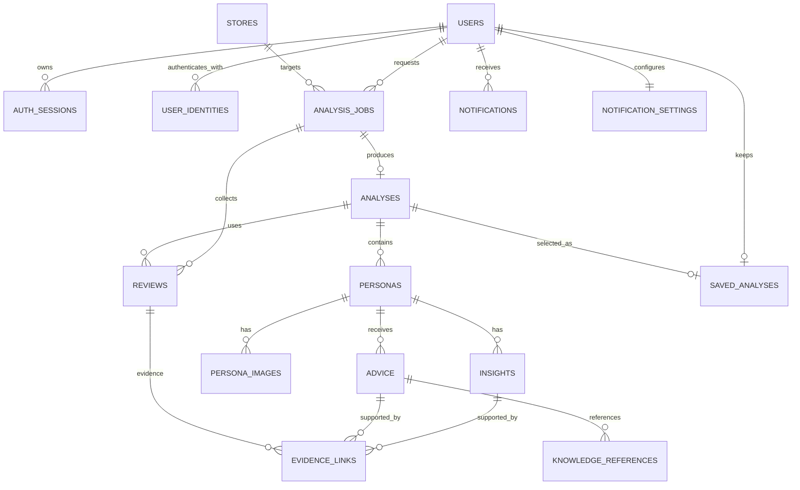

# SCC — PostgreSQL 데이터 모델 설계

| 항목 | 내용 |
|---|---|
| 상태 | **v1.0 — Flyway V1 초기 스키마 구현** |
| 기준일 | 2026-09-16 |
| 소유 역할 | `role:platform` |
| 데이터베이스 | PostgreSQL 단일 사용 |
| API 설계 | [API.md](API.md) |
| 저장 정책 | [ADR-005](../decisions/ADR-005-analysis-storage-policy.md) |
| 초기 스키마 결정 | [ADR-007](../decisions/ADR-007-initial-database-schema.md) |

이 문서는 기존 PULSE의 MySQL 사용자·매장 데이터와 MongoDB 작업·리뷰·결과 문서를 SCC의 PostgreSQL 단일 데이터베이스에 맞게 변환한 모델이다. 컬럼명·타입·제약의 구현 정본은 `backend/spring-api/src/main/resources/db/migration/**`이며 이 문서는 의미와 후속 결정을 설명한다.

PostgreSQL을 MongoDB처럼 하나의 거대한 JSON 문서 저장소로 사용하지 않는다. 권한·저장 한도·근거 연결·교체 트랜잭션에 필요한 관계는 테이블과 외래키로 표현하고, 제공자별 부가 메타데이터처럼 구조가 가변적인 값만 제한적으로 `jsonb`를 사용한다.

---

## 1. 데이터 원칙

1. 인증 사용자와 모든 분석 작업·결과는 `user_id`로 격리한다.
2. 클라이언트가 보낸 `userId`, 내부 `storeId`, 분석 상태를 신뢰하지 않는다.
3. 리뷰 작성자 닉네임·프로필 링크·이미지 URL·계정 식별자를 컬럼으로 만들지 않는다.
4. 리뷰 본문은 분석 재현성과 근거 제공에 필요한 범위에서만 저장하며 보관 기간은 정책 확정 후 적용한다.
5. 계정당 저장 분석은 `saved_analyses.user_id` 기본키로 최대 1개를 보장한다.
6. 분석 결과의 4관점은 반드시 페르소나에 연결한다.
7. 모든 시간은 `timestamptz`, 식별자는 UUID를 우선한다.
8. 외부 응답에는 내부 DB 순번·스키마 이름·비밀정보를 노출하지 않는다.

---

## 2. 관계 개요

---

## 3. 인증과 사용자

### 3.1 `users`

| 컬럼 | 논리 타입 | 제약·설명 |
|---|---|---|
| `id` | uuid | PK |
| `login_email` | varchar | 정규화된 이메일, unique |
| `credential_hash` | varchar nullable | 자체 계정만 사용. 비밀번호 원문 저장 금지 |
| `phone_number` | varchar nullable | 자체 계정 필수. Google 계정 연결 정책은 미정 |
| `status` | varchar | `ACTIVE`, `LOCKED`, `WITHDRAWN` 후보. 탈퇴 정책 확정 전 enum 고정 금지 |
| `created_at` | timestamptz | 생성 시각 |
| `updated_at` | timestamptz | 변경 시각 |

Google과 자체 로그인을 같은 사용자로 연결하는 규칙이 미정이므로 provider 식별자는 별도 테이블로 분리한다.

### 3.2 `user_identities`

| 컬럼 | 논리 타입 | 제약·설명 |
|---|---|---|
| `id` | uuid | PK |
| `user_id` | uuid | FK → `users.id` |
| `provider` | varchar | `LOCAL`, `GOOGLE` |
| `provider_subject` | varchar | 외부 provider subject. LOCAL은 내부 식별값 |
| `created_at` | timestamptz | 생성 시각 |

`(provider, provider_subject)`에 unique 제약을 둔다.

### 3.3 `auth_sessions`

| 컬럼 | 논리 타입 | 제약·설명 |
|---|---|---|
| `id` | uuid | PK |
| `user_id` | uuid | FK → `users.id` |
| `refresh_token_hash` | varchar | 원문 토큰 저장 금지 |
| `expires_at` | timestamptz | 만료 시각 |
| `revoked_at` | timestamptz nullable | 폐기 시각 |
| `created_at` | timestamptz | 생성 시각 |

토큰 형식과 회전 정책이 확정되기 전에는 실제 컬럼을 migration으로 고정하지 않는다.

---

## 4. 가게와 분석 작업

### 4.1 `stores`

SCC는 가입 시 매장 소유 관계를 강제하지 않는다. 사용자가 분석 요청마다 입력한 가게를 서버가 네이버 URL로 검증하고 정규화한 참조다.

| 컬럼 | 논리 타입 | 제약·설명 |
|---|---|---|
| `id` | uuid | PK |
| `name` | varchar | 검증된 표시 이름 |
| `category` | varchar | 허용 업종 enum |
| `naver_place_url` | text | 정규화한 최종 URL |
| `naver_place_id` | varchar nullable | 안정적으로 식별 가능한 경우 저장 |
| `created_at` | timestamptz | 생성 시각 |
| `updated_at` | timestamptz | 변경 시각 |

허용 네이버 URL과 place ID 추출 방식이 확정되기 전에는 URL unique 규칙을 고정하지 않는다.

### 4.2 `analysis_jobs`

| 컬럼 | 논리 타입 | 제약·설명 |
|---|---|---|
| `id` | uuid | PK, 외부 `jobId` |
| `user_id` | uuid | FK → `users.id` |
| `store_id` | uuid | FK → `stores.id` |
| `idempotency_key` | varchar | 동일 요청 재전송 식별 |
| `request_hash` | varchar | 같은 키에 다른 payload 사용 방지 |
| `status` | varchar | `QUEUED`, `RUNNING`, `COMPLETED`, `FAILED` |
| `progress_step` | varchar | API 계약의 단계 enum |
| `message_code` | varchar nullable | 사용자 메시지 번역·정규화용 코드 |
| `error_code` | varchar nullable | 공개 가능한 표준 오류 코드 |
| `retryable` | boolean | 사용자 재시도 가능 여부 |
| `attempt_count` | integer | 0 이상 |
| `started_at` | timestamptz nullable | 시작 시각 |
| `completed_at` | timestamptz nullable | 완료·실패 시각 |
| `created_at` | timestamptz | 생성 시각 |
| `updated_at` | timestamptz | 변경 시각 |

필수 제약:

- `(user_id, idempotency_key)` unique
- `(id, user_id)`, `(id, user_id, store_id)` unique — 하위 데이터의 소유권 복합 FK로 연결
- `attempt_count >= 0`
- `COMPLETED` 또는 `FAILED`이면 `completed_at` 필수
- 동시 분석 수 제한은 미정이므로 활성 작업 partial unique index를 아직 확정하지 않는다.

---

## 5. 리뷰와 분석 결과

### 5.1 `reviews`

| 컬럼 | 논리 타입 | 제약·설명 |
|---|---|---|
| `id` | uuid | PK |
| `job_id` | uuid | FK → `analysis_jobs.id`, 분석 당시 스냅샷 범위 |
| `analysis_id` | uuid nullable | FK → `analyses.id`. 수집 중에는 null, 결과 조립 시 해당 작업의 분석으로 고정 |
| `platform` | varchar | MVP는 `NAVER`만 허용 |
| `content` | text | 비식별 리뷰 본문 |
| `normalized_content` | text | 중복·분석용 정규화 본문 |
| `rating` | numeric nullable | 출처에서 확인된 경우만 |
| `written_at` | date nullable | 작성일 미확인 가능 |
| `collected_at` | timestamptz | 수집 시각 |
| `content_hash` | varchar | 작성자 정보 없이 중복 판별 |
| `source_metadata` | jsonb | 식별정보를 제외한 제공자별 최소 메타데이터 |

`(job_id, content_hash)`에 unique 제약을 둔다. `author`, `nickname`, `profile_url`, `profile_image_url` 컬럼은 만들지 않는다.

`analysis_id`가 설정되면 `(analysis_id, job_id)`가 `analyses.(id, job_id)`와 일치해야 한다. `(id, analysis_id)`도 unique로 두어 근거 연결의 복합 FK 대상이 되게 한다. 따라서 다른 작업에서 수집한 리뷰를 결과 근거로 연결할 수 없다.

### 5.2 `analyses`

| 컬럼 | 논리 타입 | 제약·설명 |
|---|---|---|
| `id` | uuid | PK, 외부 `analysisId` |
| `job_id` | uuid | FK → `analysis_jobs.id`, unique |
| `user_id` | uuid | FK → `users.id`, 권한 조회용 |
| `store_id` | uuid | FK → `stores.id` |
| `collected_review_count` | integer | 수집 원본 건수 |
| `valid_review_count` | integer | 분석 실제 사용 건수, 50 이상 |
| `contains_old_reviews` | boolean | 2년 초과 리뷰 포함 여부 |
| `schema_version` | varchar | 결과 스키마 버전 |
| `model_versions` | jsonb | 분석·이미지 모델 버전 추적 |
| `limitations` | jsonb | 코드와 표시 문구에 필요한 한계 목록 |
| `collected_at` | timestamptz | 수집 기준 시각 |
| `analyzed_at` | timestamptz | 분석 완료 시각 |

`valid_review_count >= 50`이어야 완료 분석을 생성할 수 있다. 유효 토픽이 0~2개인 것은 리뷰 총량 부족과 다른 상태이며 완료 분석 안에서 빈 포디움 슬롯으로 표현한다.

소유권 일치 제약:

- `(job_id, user_id, store_id)`는 `analysis_jobs.(id, user_id, store_id)`를 참조한다.
- `(id, job_id)`, `(id, user_id)`는 하위 테이블과 저장 결과가 복합 FK로 참조할 수 있도록 unique로 둔다.
- API는 `analyses.user_id` 단독 값이 아니라 위 복합 FK가 보장된 작업 소유자를 기준으로 권한을 판정한다.

### 5.3 `personas`

| 컬럼 | 논리 타입 | 제약·설명 |
|---|---|---|
| `id` | uuid | PK |
| `analysis_id` | uuid | FK → `analyses.id` |
| `rank` | smallint | 1~3 |
| `topic_review_count` | integer | 해당 토픽 근거 리뷰 수 |
| `label` | varchar | 손님 유형명 |
| `summary` | text | 리뷰 관찰 범위의 요약 |
| `caveat` | text | 실제 개인·전체 고객 대표가 아님을 알림 |

제약:

- `(analysis_id, rank)` unique
- `(id, analysis_id)` unique — insight·advice의 분석 경계를 복합 FK로 보장
- `rank BETWEEN 1 AND 3`
- 한 분석에 0~3개만 허용
- 빈 포디움 슬롯은 가짜 persona row를 만들지 않고 API 조립 단계에서 생성

### 5.4 `insights`

| 컬럼 | 논리 타입 | 제약·설명 |
|---|---|---|
| `id` | uuid | PK |
| `persona_id` | uuid | FK → `personas.id` |
| `analysis_id` | uuid | 복합 FK `(persona_id, analysis_id)` → `personas.(id, analysis_id)` |
| `kind` | varchar | `POSITIVE`, `NEGATIVE`, `PERCEPTION`, `PRIORITY` |
| `review_fact` | text | 리뷰에서 직접 확인된 사실 |
| `ai_interpretation` | text nullable | AI 해석. 사실과 분리 |
| `sort_order` | integer | 같은 관점 내 표시 순서 |

근거가 없는 insight는 저장·표시하지 않는다.
`(id, analysis_id)`를 unique로 두어 evidence가 동일 분석 범위의 insight만 참조하도록 한다.

### 5.5 `advice`

| 컬럼 | 논리 타입 | 제약·설명 |
|---|---|---|
| `id` | uuid | PK |
| `persona_id` | uuid | FK → `personas.id` |
| `analysis_id` | uuid | 복합 FK `(persona_id, analysis_id)` → `personas.(id, analysis_id)` |
| `review_fact` | text | 기본 노출 |
| `suggested_action` | text | 기본 노출, 보장이 아닌 검토할 행동 |
| `ai_interpretation` | text nullable | 펼쳐보기 |
| `sort_order` | integer | 표시 순서 |

`(id, analysis_id)`를 unique로 두어 evidence가 동일 분석 범위의 advice만 참조하도록 한다.

### 5.6 `knowledge_references`

| 컬럼 | 논리 타입 | 제약·설명 |
|---|---|---|
| `id` | uuid | PK |
| `advice_id` | uuid | FK → `advice.id` |
| `source_id` | varchar | 승인된 지식 자료 식별자 |
| `title` | varchar | 표시 가능한 자료명 |
| `locator` | text | 문서·절 등 확인 가능한 위치 |
| `retrieved_at` | timestamptz | 검색 시각 |

### 5.7 `persona_images`

| 컬럼 | 논리 타입 | 제약·설명 |
|---|---|---|
| `id` | uuid | PK |
| `persona_id` | uuid | FK → `personas.id`, unique |
| `storage_key` | text | 실제 이미지 저장소 키. 공개 URL을 영구값으로 저장하지 않음 |
| `alt_text` | text | 이미지 기능 설명 |
| `style_version` | varchar | 화풍·톤·구성 규칙 버전 |
| `model_version` | varchar | OpenAI 이미지 모델 추적 |
| `status` | varchar | 생성 상태 |
| `created_at` | timestamptz | 생성 시각 |

이미지 바이너리를 PostgreSQL에 직접 저장할지는 확정하지 않았다. 기본 설계는 객체 저장소의 키와 메타데이터만 PostgreSQL에 저장하는 방식이다.

---

## 6. 근거 연결

### 6.1 `evidence_links`

| 컬럼 | 논리 타입 | 제약·설명 |
|---|---|---|
| `id` | uuid | PK |
| `analysis_id` | uuid | 모든 연결 대상이 속해야 하는 분석 |
| `review_id` | uuid | 복합 FK `(review_id, analysis_id)` → `reviews.(id, analysis_id)` |
| `insight_id` | uuid nullable | 복합 FK `(insight_id, analysis_id)` → `insights.(id, analysis_id)` |
| `advice_id` | uuid nullable | 복합 FK `(advice_id, analysis_id)` → `advice.(id, analysis_id)` |
| `excerpt` | text | 화면에 표시할 비식별 인용 범위 |
| `sort_order` | integer | 대표 근거 우선순위 |

`insight_id`, `advice_id` 중 정확히 하나만 값이 있도록 CHECK 제약을 둔다. 복합 FK로 리뷰와 insight 또는 advice가 모두 같은 `analysis_id`에 속하도록 보장한다. 페르소나 자체의 근거는 해당 페르소나의 insight를 통해 연결한다.

권장 인덱스:

- `(insight_id, sort_order)` WHERE `insight_id IS NOT NULL`
- `(advice_id, sort_order)` WHERE `advice_id IS NOT NULL`
- `(review_id)`

---

## 7. 저장 분석과 마이페이지

### 7.1 `saved_analyses`

| 컬럼 | 논리 타입 | 제약·설명 |
|---|---|---|
| `user_id` | uuid | PK, FK → `users.id` |
| `analysis_id` | uuid | unique, 복합 FK `(analysis_id, user_id)` → `analyses.(id, user_id)` |
| `saved_at` | timestamptz | 저장·교체 시각 |

첫 결과 자동 저장과 이후 교체는 다음 규칙을 따른다.

1. 첫 결과 자동 저장은 Spring Boot의 완료 트랜잭션에서 `INSERT ... ON CONFLICT (user_id) DO NOTHING`으로 처리한다. 동시에 완료된 다른 작업이 있어도 먼저 커밋된 첫 저장본을 덮어쓰지 않는다.
2. 사용자가 명시적으로 교체할 때는 기존 `saved_analyses` row를 `FOR UPDATE`로 잠그고 새 분석이 같은 사용자 소유이며 완료 상태인지 확인한 뒤 update한다.
3. `(analysis_id, user_id)` 복합 FK가 다른 사용자 분석 저장을 차단하고, `user_id` PK가 계정당 최대 1개를 보장한다.

### 7.2 `notifications`

| 컬럼 | 논리 타입 | 제약·설명 |
|---|---|---|
| `id` | uuid | PK |
| `user_id` | uuid | FK → `users.id` |
| `job_id` | uuid | 복합 FK `(job_id, user_id)` → `analysis_jobs.(id, user_id)` |
| `type` | varchar | `ANALYSIS_COMPLETED`, `ANALYSIS_FAILED` |
| `message_code` | varchar | 사용자 문구 생성용 |
| `read_at` | timestamptz nullable | 읽음 시각 후보 |
| `created_at` | timestamptz | 생성 시각 |

`(job_id, type)`에 unique 제약을 두어 완료·실패 상태 전이 재시도에도 같은 알림이 중복 생성되지 않게 한다. 읽음 처리 기능은 제품 요구사항에 확정되지 않았으므로 `read_at` 사용과 API는 구현 전 확인한다.

### 7.3 `notification_settings`

| 컬럼 | 논리 타입 | 제약·설명 |
|---|---|---|
| `user_id` | uuid | PK, FK → `users.id` |
| `analysis_result_enabled` | boolean | NOT NULL, 기본값 `true` |
| `updated_at` | timestamptz | 변경 시각 |

OS push token과 홍보 수신 동의 컬럼은 MVP 범위가 아니므로 만들지 않는다.
사용자 생성 트랜잭션에서 기본 설정 row도 함께 만든다. 완료·실패 전이 트랜잭션은 이 row를 잠가 현재 값을 읽고 알림 생성 여부를 결정하므로 설정 변경과 작업 완료가 동시에 일어나도 결과가 한 순서로 직렬화된다.

---

## 8. 권장 인덱스

| 테이블 | 인덱스 | 목적 |
|---|---|---|
| `auth_sessions` | `(user_id, revoked_at, expires_at)` | 유효 세션 조회 |
| `analysis_jobs` | `(user_id, created_at DESC)` | 사용자 작업 이력·최신 상태 |
| `analysis_jobs` | `(status, updated_at)` | 복구·운영 작업 탐색 |
| `reviews` | `(job_id, content_hash)` unique | 작업 내 중복 방지 |
| `analyses` | `(user_id, analyzed_at DESC)` | 사용자 분석 소유권·최신 조회 |
| `personas` | `(analysis_id, rank)` unique | 포디움 조립 |
| `notifications` | `(user_id, created_at DESC)` | 인앱 알림 조회 |

동시 활성 분석을 하나로 제한하는 partial unique index는 동시 분석 정책이 확정된 뒤 추가한다.

---

## 9. 삭제·보관 정책

보관 기간은 아직 확정되지 않았다. migration에 임의 TTL이나 자동 삭제 기간을 넣지 않는다. 정책 확정 시 최소한 다음을 함께 결정한다.

- 실패·완료 작업 보관 기간
- 원본 리뷰와 정규화 리뷰 보관 기간
- 미저장 분석 결과 최대 보관 시간
- 저장 결과 교체 후 이전 분석·이미지 삭제 시점
- 계정 탈퇴 시 세션·분석·리뷰·이미지 연계 삭제
- 법적 요청이나 플랫폼 이의 제기 시 삭제 절차

PostgreSQL에는 MongoDB TTL 인덱스가 없다. 자동 삭제가 필요하면 명시적인 배치 작업과 삭제 기준 인덱스를 구현하고 실제 실행 결과를 관측해야 한다.

---

## 10. 서비스별 DB 접근 경계

PostgreSQL 하나를 사용하더라도 Spring Boot와 Python이 모든 테이블을 같은 권한으로 직접 수정하게 하지 않는다.

권장 출발점:

| 서비스 | 쓰기 책임 |
|---|---|
| Spring Boot | 사용자·인증 세션·분석 작업의 공개 상태·저장 분석 선택·알림·알림 설정 |
| Python 분석 컴포넌트 | 리뷰·분석·페르소나·근거·제안·이미지 메타데이터를 준비 상태로 기록 |

[ADR-007](../decisions/ADR-007-initial-database-schema.md)에 따라 V1은 `public` schema 하나에 생성한다. 로컬·통합 테스트 단계에서는 migration과 애플리케이션이 같은 DB 계정을 사용할 수 있지만 운영 배포 전에는 Spring·Python의 런타임 role과 Flyway migration role을 분리해야 한다. migration 파일은 Spring Boot의 `backend/spring-api/src/main/resources/db/migration/**`에서 Flyway로 단독 관리한다. 하나의 트랜잭션이 양쪽 책임을 동시에 수정해야 하는 설계는 피하고, 작업 ID와 명시적 상태 전이로 연결한다.

분석 완료 경계는 Spring Boot가 소유한다.

1. Python은 모든 결과와 근거를 PostgreSQL에 기록하고 작업 ID와 결과 ID를 준비 완료로 전달한다. Python은 공개 상태를 `COMPLETED`로 바꾸지 않는다.
2. Spring Boot는 결과가 같은 `(job_id, user_id, store_id)`에 속하고 필수 산출물·근거 제약을 충족하는지 확인한다.
3. 하나의 PostgreSQL 트랜잭션에서 작업을 `COMPLETED`로 전이하고, `saved_analyses`가 없으면 첫 결과를 insert한다. 현재 알림 설정 row를 잠가 `analysis_result_enabled=true`인 경우에만 `(job_id, type)` unique를 이용해 완료 알림을 insert한다.
4. 트랜잭션 전후 장애가 나면 작업은 `RUNNING`으로 남거나 이미 완전히 완료된 상태 중 하나이며, 재조정 작업이 같은 전이를 멱등하게 재시도한다.
5. 실패 확정도 Spring Boot가 작업 `FAILED` 전이와, 알림 설정이 켜진 경우의 실패 알림 insert를 하나의 트랜잭션에서 처리한다.

결과·근거 조회 API는 작업이 `COMPLETED`가 된 분석만 반환한다.

---

## 11. 후속 migration 전 미확정 항목

1. 운영 환경의 Spring·Python 런타임 DB role과 Flyway migration role 분리
2. auth token 저장 모델
3. 전화번호 정규화·암호화·중복 정책
4. 네이버 place ID와 URL unique 규칙
5. 동시 분석 작업 수와 활성 작업 unique 제약
6. 리뷰·결과·이미지·알림 보관 기간
7. 이미지 바이너리 저장소
8. 알림 읽음 처리 여부

V1은 위 미확정 정책을 고정하지 않는다. 특히 `auth_sessions`는 토큰 저장·회전 정책이 확정된 뒤 만들며, 전화번호와 네이버 URL에는 아직 unique 제약을 두지 않고, 자동 삭제 정책도 추가하지 않는다.
