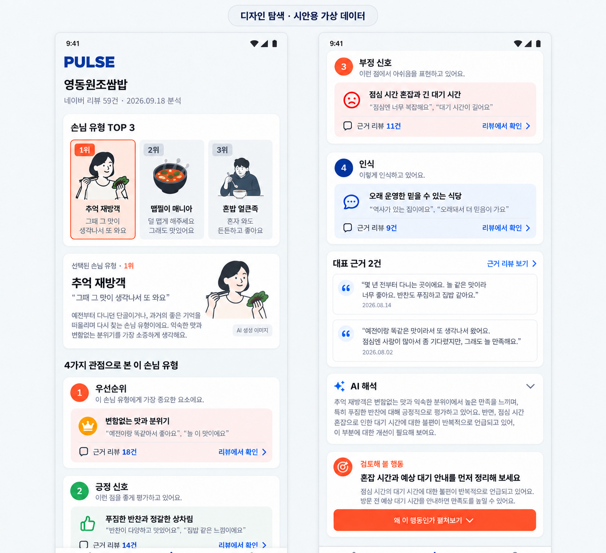
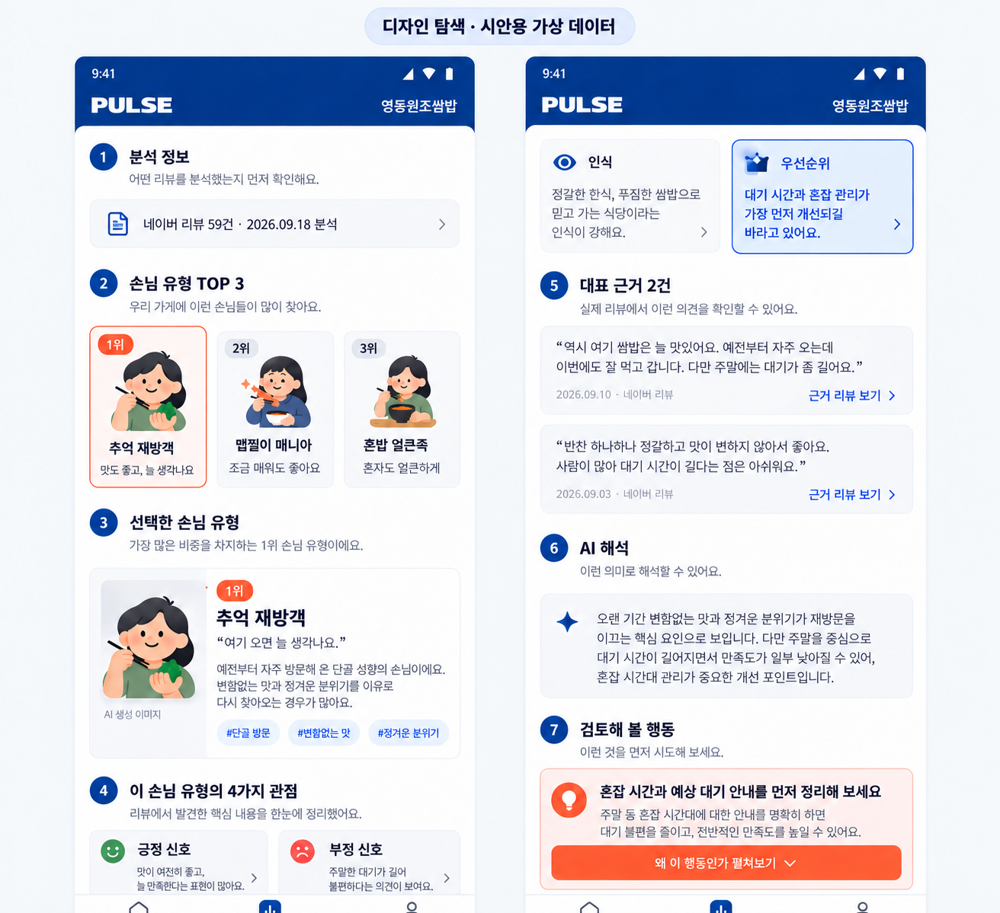
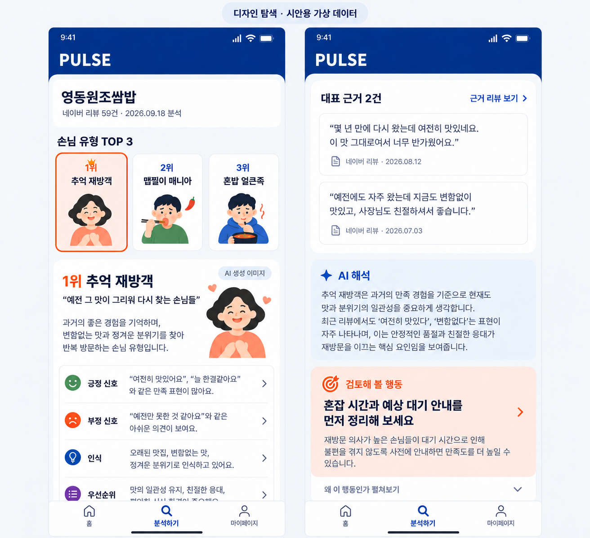
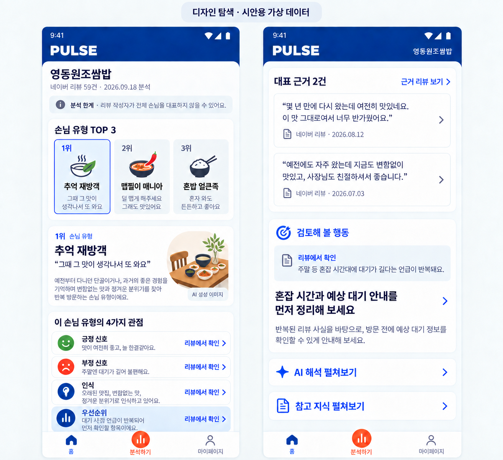

# TASK-015 — 분석 결과 화면 디자인 탐색

## Status

ImageGen을 이용한 방향 탐색 완료. D는 비교 결과 가장 적합한 잠정 추천 후보이며 사용자·팀의 선택 전에는 확정안이 아니다. 네 이미지는 제품 화면 구현에 바로 사용하는 시안이 아니라 정보 구조와 시각적 우선순위를 비교하기 위한 근거 자료다.

> 모든 상호명, 리뷰, 날짜, 리뷰 수, 손님 유형 설명은 시안용 가상 데이터다. 실제 분석 결과나 제품 요구사항으로 해석하지 않는다.

## Input

- [PRD](../../../product/PRD.md)
- [결과 화면 IA](../../../product/requirements/RESULT_IA.md)
- [디자인 시스템](../../DESIGN_SYSTEM.md)
- 실제 토큰 정본: `frontend/mobile/src/design/tokens/foundation.ts`

고정한 읽기 순서는 `분석 메타데이터 → 손님 유형 TOP 3 → 선택 유형 → 4가지 관점 → 대표 근거 → 리뷰 사실 + 검토할 행동 → 접힌 AI 해석·참고 지식`이다. 사실·리뷰 근거와 AI 해석을 색상만이 아니라 제목, 위치, 컨테이너로 구분했다.

## Concepts

### A — Evidence Ledger

- 장점: 각 판단에서 근거 리뷰로 이동하는 관계가 가장 분명하다.
- 위험: 사람 형태의 페르소나 그림이 불필요한 인구통계적 인상을 줄 수 있고, 카드 밀도가 높다.
- 채택: 4가지 관점 각각에 근거 진입점을 둔다.

### B — Guided Narrative

- 장점: 번호와 설명으로 처음 보는 사용자의 읽기 순서를 가장 잘 안내한다.
- 위험: 캐릭터와 장식이 다소 유희적이며, 긴 결과 화면에서는 번호 체계가 시각적 부담이 될 수 있다.
- 채택: 각 구간의 제목을 평이한 문장으로 쓴다.

### C — Focused Comparison

- 장점: TOP 3와 4가지 관점을 빠르게 비교하기 좋다.
- 위험: 기존 토큰에 없는 보라색과 사람 중심 페르소나 표현은 디자인 시스템과 맞지 않는다.
- 채택: 동일한 행 구조로 4가지 관점을 세로 배치한다.

### D — Synthesis, Recommended Candidate

A의 근거 연결, B의 읽기 안내, C의 압축된 TOP 3와 일관된 관점 행을 결합한 잠정 추천 후보다. 사람 캐릭터 대신 음식과 공간을 상징적으로 보여 주고 `AI 생성 이미지`임을 화면 안에서 밝힌다. 행동 제안은 반복된 리뷰 사실과 함께 기본 노출하고, AI 해석과 참고 지식은 접힌 상태로 뒤에 둔다.

## Candidate Elements to Adopt

1. 상단에 상호명, 수집 채널·리뷰 수, 분석 시점, 한계를 먼저 제시한다.
2. TOP 3는 세 슬롯을 항상 보존하고 `리뷰에서 많이 반복된 순서`임을 설명하며 선택 상태만 파란색으로 강조한다.
3. 페르소나 이미지는 보조 요소로 제한하며 성별·연령·직업을 암시하는 사람 그림을 쓰지 않는다.
4. 긍정 신호, 부정 신호, 인식, 우선순위를 같은 행 구조로 보여 주고 각 행에 근거 진입점을 둔다.
5. 대표 리뷰 다음에는 `리뷰에서 확인`한 사실과 결과를 보장하지 않는 `검토해 볼 행동`을 함께 보여 준다.
6. AI 해석과 참고 지식은 별도 제목의 접힌 행으로 뒤에 두고 사용자가 선택해서 펼치게 한다.
7. 하단 내비게이션의 중앙 분석 액션에만 주황색 강조를 사용한다.

## Rejected or Deferred

- 성별·연령 등 인구통계를 연상시키는 사람 페르소나
- 토큰에 없는 보라색 등 새 브랜드 색상
- 근거 없는 비율, 점수, 차트와 실제 작성자처럼 보이는 신원 정보
- 대표 근거보다 먼저 등장하는 강한 행동 CTA
- `만족도를 높인다`처럼 결과를 약속하는 문구
- TOP 3 고정(sticky) 처리: 작은 화면과 TalkBack 탐색 비용을 확인한 뒤 결정한다.

## Implementation Gate

이 산출물만으로 제품 화면 구현을 시작하지 않는다. 먼저 사용자·팀이 D 또는 다른 조합을 명시적으로 선택해야 한다. 이후에도 최소 Android OS, 지원 기기 범위, 작은 화면/API 조합, 개발 빌드 식별자와 scheme을 제품·플랫폼에서 확정해야 한다. 구현 시에는 생성 이미지의 픽셀이나 가상 문구를 복사하지 않고 디자인 토큰과 실제 데이터 계약을 사용한다.

생성 조건과 프롬프트 요약은 [PROMPTS.md](PROMPTS.md)에 있다.
