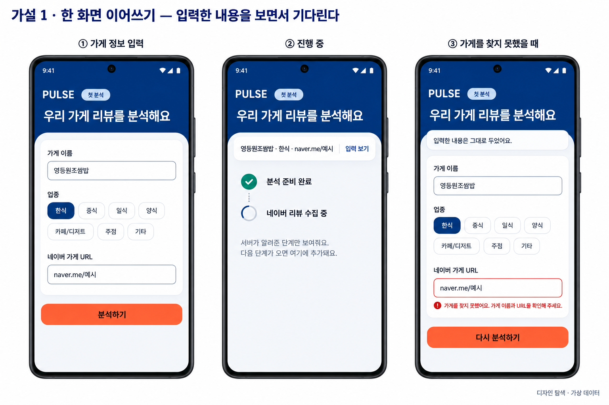
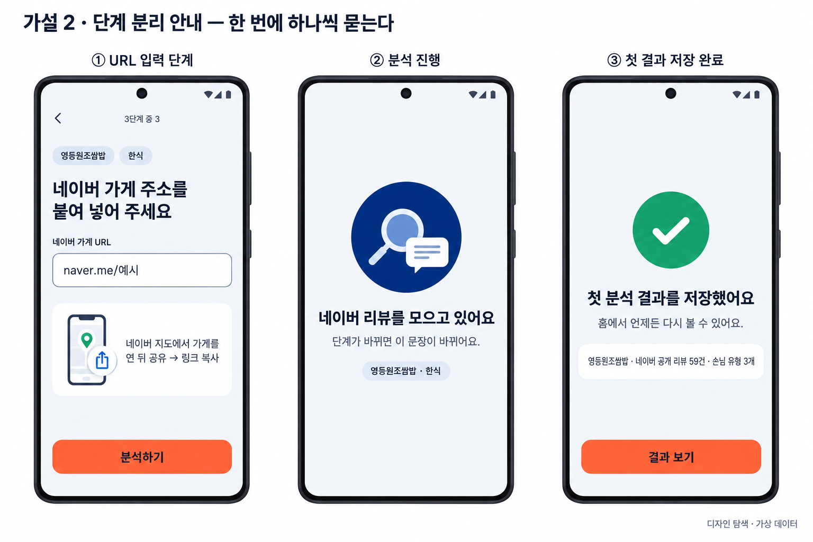
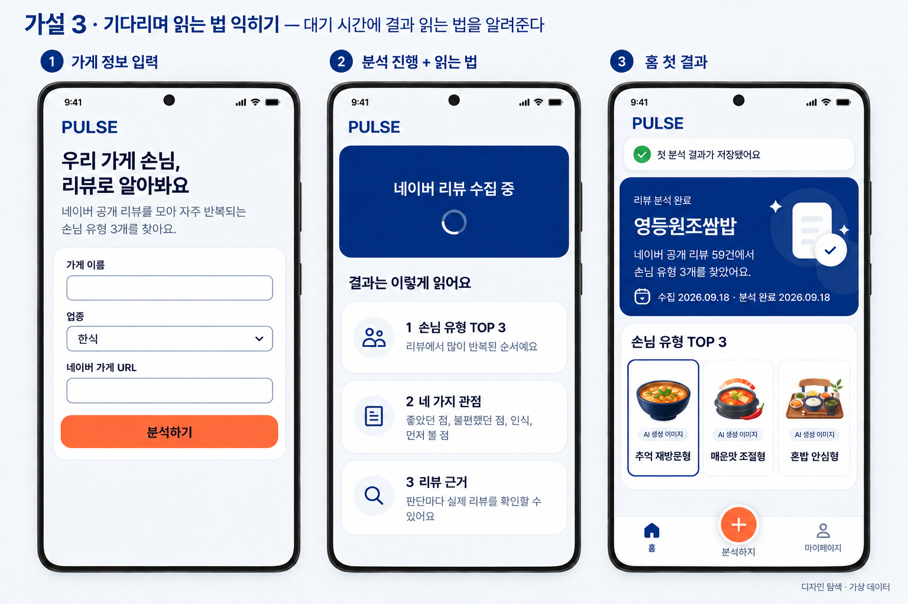
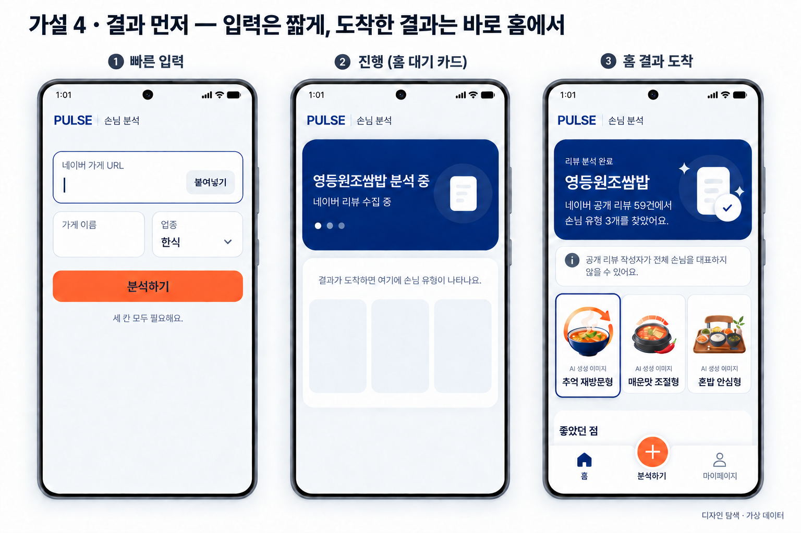
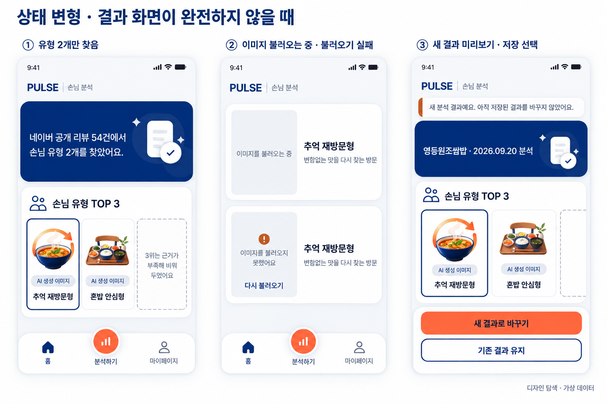

# TASK-020 — Vertical Slice 흐름·결과 상태 디자인 탐색 (Step 4)

## Status

ImageGen으로 서로 다른 UX 가설 4개와 결과 상태 변형 보드 1개를 만들었다. **확정안이 아니다.** Step 5 Design Synthesis에서 사용자가 조합을 선택하기 전까지 어떤 요소도 채택된 것으로 보지 않는다.

> 화면의 상호명·리뷰 수·날짜·유형 이름은 모두 가상 데이터다. 각 PNG 오른쪽 아래에 `디자인 탐색 · 가상 데이터`를 표시했다. ImageGen 결과는 배치와 흐름을 비교하는 자료이며, 간격·문자열·접근성 통과를 보장하는 구현 산출물이 아니다.

## Why this exploration

결과 화면의 정상 상태는 [TASK-015](../TASK-015/README.md)·[TASK-017](../TASK-017/README.md)에서 두 번 탐색했고 [TASK-016 합성안](../../synthesis/TASK-016/README.md)이 프로토타입으로 구현됐다. 그래서 정상 결과 화면은 다시 탐색하지 않았다.

Step 2 화면 상태 모델([SCREEN_STATES](../../../product/requirements/SCREEN_STATES.md))과 Step 3 디자인 기반([DESIGN_SYSTEM](../../DESIGN_SYSTEM.md))을 거친 뒤 시안이 없는 부분은 다음이었다.

1. 첫 Vertical Slice 흐름(SCREEN_STATES §10) 중 결과 앞 단계 — 가게 입력(`SC-001`), 분석 진행(`SC-003`), 첫 저장과 홈(`SC-010`·`SC-011`)
2. 결과가 완전하지 않은 상태 — 유형 부족(`RESULT-PARTIAL`), 이미지 로딩·조회 실패(`IMAGE-LOADING`·`IMAGE-LOAD-ERROR`). 미저장 새 결과(`RESULT-UNSAVED-PREVIEW`·`SAVE-CHOICE-REQUIRED`)는 §10이 **다음 Slice**로 둔 흐름이지만 결과 문맥 표현이 같이 정해져야 해 함께 그렸다
3. DESIGN_SYSTEM §13에서 Step 4로 넘긴 결정 — 로딩 자리표시·이미지 실패·빈 포디움 슬롯의 시각 구분

## Fixed constraints

모든 보드에 **지시한** 조건이다. 전체 문구는 [PROMPTS.md](PROMPTS.md)에 있다. 결과 이미지가 모두 지킨 것은 아니다 — 어긋난 점은 각 보드 표와 [Known defects](#known-defects)에 적었다.

- 색은 `foundation.ts` 토큰 값만 사용. 화면당 오렌지 주요 버튼 하나, 버튼 글씨는 `#191F28`
- 입력 3개(가게 이름·업종·네이버 가게 URL)에 보이는 라벨. 업종은 DESIGN_SYSTEM §5.5의 7개 값
- 작업 생성 전 가게 확인(`SC-002`)은 API가 없어 넣지 않음(SCREEN_STATES §4.3)
- 진행 화면은 퍼센트·예상 시간 없이, 서버가 보낸 단계만 표시(§5). 오지 않은 단계를 미리 나열하지 않음
- 첫 분석 전에는 하단 내비게이션 없음(`NAV-HIDDEN`)
- 사람·인구통계 암시 없이 음식 중심 이미지, `AI 생성 이미지` 표시

## Hypotheses

### 가설 1 — 한 화면 이어쓰기

| 항목 | 내용 |
|---|---|
| 최적화 | 입력한 내용을 계속 보면서 기다리기. 오류가 나면 같은 자리로 돌아와 고치기 |
| 상태 대응 | 작업 실패 뒤 입력 화면으로 돌아와 입력값을 유지한다(§4.1). 진행 목록은 받은 단계만 쌓는다(§5). 실패한 단계도 같은 목록에 표시할 수 있다 |
| trade-off | ③은 `STORE-NOT-FOUND` 오류를 URL 필드에만 붙였다. §4.2는 "이름·URL 필드 가까이"이므로 그대로 쓰면 안 된다. 백엔드가 지금 `QUEUED → COLLECTING_REVIEWS`만 보내므로 목록이 두 줄에서 멈춰 보일 수 있다. ②의 "서버가 알려준 단계만 보여줘요…"는 구현 방식을 드러내는 문장이라 사용자 카피로 쓸 수 없다. 완료 뒤 홈으로 넘어가는 순간이 그려지지 않았다. 네이비 헤더가 결과 화면 히어로와 겹쳐 보일 수 있다 |

### 가설 2 — 단계 분리 안내

| 항목 | 내용 |
|---|---|
| 최적화 | 처음 쓰는 사장님이 한 번에 한 질문만 답하기. URL을 얻는 방법 안내 |
| 상태 대응 | 진행은 현재 단계 한 문장만 바꾼다. 첫 저장 완료를 별도 화면으로 보여준다(`SAVE-FIRST-SUCCESS`) |
| trade-off | 입력 3화면 + 완료 화면으로 탭 수가 가장 많다. `3단계 중 3` 입력 단계 표시가 분석 진행 단계와 헷갈릴 수 있다. 도움 카드의 "네이버 지도에서 가게를 연 뒤 공유 → 링크 복사"는 **네이버 앱에서 확인하지 않은 안내**라 그대로 쓸 수 없다. 작업 실패로 입력 화면에 돌아올 때 어느 단계로 보낼지 정해야 한다. ③의 성공 원형(표본 `#159F6D`)과 ①의 도움 그림 녹색 핀·파란 공유 아이콘은 토큰 밖 색이다 |

### 가설 3 — 기다리며 읽는 법 익히기

| 항목 | 내용 |
|---|---|
| 최적화 | 대기 시간을 결과 읽는 법(TOP 3 → 4관점 → 근거)을 익히는 데 쓰기 |
| 상태 대응 | 첫 저장은 홈 상단 띠("첫 분석 결과가 저장됐어요")로 알려 별도 화면이 없다. 읽는 법 카드는 실제 데이터 없이 구조만 설명한다 |
| trade-off | 분석할 때마다 같은 설명이 반복된다. 설명 카드가 결과 구조와 어긋나면 정본이 둘이 된다. 사장님이 실제로 읽는지 검증하지 않았다 |

### 가설 4 — 결과 먼저

| 항목 | 내용 |
|---|---|
| 최적화 | 입력을 가장 짧게(URL을 맨 위에, 붙여넣기 버튼), 결과가 들어올 자리를 미리 보여주기 |
| 상태 대응 | 진행 화면이 홈과 같은 모양이라 완료 뒤 전환이 가장 작다 |
| trade-off | 빈 자리표시 3칸이 로딩 중인 실제 결과처럼 보일 수 있다(DESIGN_SYSTEM §5.2가 금지하는 방향). 저장본이 있는 사용자의 재분석에서는 기존 결과와 대기 카드가 한 홈에 섞인다. 가게 이름·업종을 두 칸으로 나눠 200% 글자 크기에서 좁아진다. 붙여넣기 버튼의 Android 클립보드 동작은 확인하지 않았다 |

## Result state board

| 화면 | 보여주는 것 | 판단 |
|---|---|---|
| ① 유형 2개만 찾음 | 3칸 유지, 빈 칸은 점선 테두리 + "3위는 근거가 부족해 비워 두었어요" | 빈 칸이 로딩처럼 보이지 않는다. 점선 경계에 `border.control`을 쓰면 3:1 이상. 히어로에서 상호명·날짜가 빠진 것은 생성 누락이라 따르지 않는다 |
| ② 이미지 로딩·실패 | 로딩은 옅은 회색 영역 + 문장, 실패는 같은 회색 영역에 주의 표시 + 문장 + "다시 불러오기". 유형 이름·설명은 유지 | 모양으로 구분되는 것은 빈 칸(점선 테두리)뿐이다. 로딩과 조회 실패는 같은 영역이고 표시 기호·문장·버튼으로만 구분된다. DESIGN_SYSTEM §13의 구분 문제 가운데 빈 칸은 풀렸지만, 로딩과 조회 실패의 구분은 아직 기호·문장에만 기대고 있다. 세 번째 이미지 실패인 `IMAGE-GENERATION-FAILED`는 결과 화면이 아니라 분석 실패로 표시되므로(SCREEN_STATES §6.4) 이 보드에 없다 |
| ③ 새 결과 미리보기 | 상단 주의 띠 "아직 저장된 결과를 바꾸지 않았어요", 하단 고정 "새 결과로 바꾸기 / 기존 결과 유지" | SCREEN_STATES §7은 미리보기 **확인을 마친 뒤** 저장 선택으로 간다. 처음부터 선택을 고정해 두는 것은 해석 차이라 Step 5에서 정해야 한다. 주의 띠는 **표시 기호 없이 막대와 문장만** 있어 DESIGN_SYSTEM §3.3(색 막대만으로 구분하지 않음)에 어긋난다. 막대 색은 프롬프트가 `#B45309`로 잘못 지정했고(PROMPTS.md 주석) 표본은 `#C25925`다. 카드 위 막대는 `status.warning` `#D97706`이 맞다. 저장본이 있는 사용자 화면인데 하단 내비게이션을 숨겼다. §9 `NAV-HIDDEN`은 저장 결과가 없을 때의 조건이라 근거가 없다 |

## Common observations

- 하단 가운데 버튼 아이콘이 보드마다 다르다(가설 3·4는 더하기, 상태 보드는 막대). 아이콘 공급원이 정해지지 않았으므로(DESIGN_SYSTEM §13) 비교 대상이 아니다.
- 모든 보드에서 가짜 퍼센트·점수·예상 시간은 나오지 않았다.
- ImageGen이 그린 문자·간격·아이콘을 자산으로 쓰지 않는다.

## Known defects

생성 이미지의 문자·색 오류다. 편집으로 고치지 못했거나 고치지 않은 것이며, 합성 근거나 카피로 옮기지 않는다.

| 파일 | 결함 |
|---|---|
| `h3-learn-while-waiting.png` | ③ 하단 가운데 라벨이 "분석하기"가 아니라 "분석하지". 편집 2회가 실패해 원본을 유지했다(PROMPTS.md 편집 원문) |
| `h2-step-guided.png` | 토큰 밖 색(성공 원형, 도움 그림 아이콘) |
| `states-incomplete-result.png` | ③ 주의 띠 기호 누락과 막대 색, ① 히어로의 상호명·날짜 누락 |

## Not explored in this step

첫 Vertical Slice(§10)에 필요하지만 이번 보드에 그리지 않은 상태와 처리 방향이다.

| 상태 | 이유 | 처리 |
|---|---|---|
| `ANALYSIS-INSUFFICIENT`, `ANALYSIS-RETRYABLE-ERROR`, `ANALYSIS-FATAL-ERROR`, `IMAGE-GENERATION-FAILED` | 분석 실패는 진행 화면 안에 표시한다(§5.2). `IMAGE-GENERATION-FAILED`도 결과 화면이 아니라 분석 실패로 안내한다(§6.4). 어디에 어떻게 놓일지는 진행 표현을 고르면 따라 정해진다 | Step 5에서 진행 표현과 함께 결정(Open question 6). 필요하면 선택한 방향으로 실패 보드를 추가 생성 |
| `STORE-CREATING-JOB` | 버튼 loading 상태 | 공용 컴포넌트 구현 전 결정(DESIGN_SYSTEM §13) |
| `HOME-LOADING` | 로딩 자리표시 규칙(DESIGN_SYSTEM §5.2) 적용 | Step 7 구현 |
| `RESULT-NO-PERSONA` | 상태 보드 ①의 빈 칸 표현을 세 칸으로 확장 | Step 5에서 빈 칸 표현을 고르면 함께 결정 |
| `STORE-FIELD-ERROR` | DESIGN_SYSTEM §5.5 입력 오류 규칙 적용 | Step 7 구현 |

## Open questions for Step 5

1. 입력은 한 화면(가설 1·3·4)인가, 단계 분리(가설 2)인가
2. 진행 표현은 받은 단계를 쌓는 목록(가설 1)인가, 현재 한 문장(가설 2·3·4)인가
3. 첫 저장을 별도 완료 화면(가설 2)으로 보여줄지, 홈 상단 띠(가설 3)로 보여줄지
4. 대기 중 설명 콘텐츠(가설 3)를 넣을지
5. 미저장 새 결과에서 저장 선택을 언제 보여줄지, 그 화면에 하단 내비게이션을 둘지
6. 고른 진행 표현에서 분석 실패(리뷰 부족·재시도 가능·서비스 문제·이미지 생성 실패)를 어디에 표시할지
7. 로딩과 이미지 조회 실패를 기호·문장 외에 모양으로도 구분할지

## ImageGen provenance

생성 방식: Codex CLI 0.155.1 내장 ImageGen(`codex exec`, read-only sandbox, 저장소 밖 스크래치 디렉터리에서 실행). 2026-09-22 사용자가 Step 4 이미지 생성에 한해 Codex 사용을 허용했다. Codex 에이전트 모델은 `gpt-5.6-sol`(실행 로그)이고, 실제 이미지 생성 모델 버전은 도구가 노출하지 않아 미확인이다. 가설 3·4와 상태 보드는 [TASK-018 Android 캡처](../../evidence/TASK-018/android-codex-fix-hero.png)를 시각 참고로 첨부했다.

| 파일 | 크기 | SHA-256 | 생성 |
|---|---:|---|---|
| `h1-single-screen.png` | 1536×1024 | `fb74c37a5fcef8adad7a6fdd1dc252f8940549f2f7a86cd1b389539e07b3f37c` | generate |
| `h2-step-guided.png` | 1536×1024 | `bd05809a2d845cb052dd6b02843c61ccaa80f694e5bfd08d44d1a1d97f223910` | generate |
| `h3-learn-while-waiting.png` | 1536×1024 | `1978c48ccd7ba950968fe6c503a94efb695d8f1c7d3dc4bea448c8fbfdb39944` | generate → edit 1회 |
| `h4-result-first.png` | 1536×1024 | `8a2d46d876c26da6fb532f9386286328da323f9db811d48cc4339106867b1252` | generate → edit 2회 |
| `states-incomplete-result.png` | 1536×1024 | `89ab6d61eb51f66155345f5bff85b9172997090939dfd95ceb1f636ac6b58362` | generate |

## Validation boundary

- 다섯 PNG를 직접 열어 공통 조건과 대조했다. 초안 문제 세 가지(장식 이미지의 AI 표시, 유형 이름 누락, 편집 중 생긴 오타)는 편집으로 고쳤고, 고치지 못한 결함은 Known defects에 적었다.
- 앱 코드는 바꾸지 않았으므로 lint·typecheck·Android export·Visual QA는 적용하지 않았다.
- 네이버 앱 공유 흐름, Android 클립보드 동작, 사장님의 실제 반응은 확인하지 않았다(미확인).
