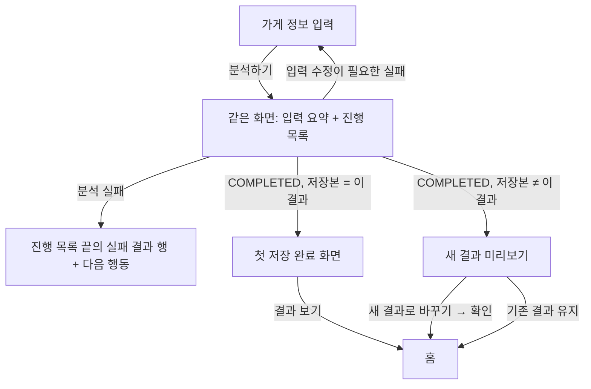

# TASK-020 — Vertical Slice 흐름·결과 상태 Design Synthesis (Step 5)

## Status

2026-09-22 사용자 선택과 그 선택에 따라 정한 세부 결정을 합친 Step 5 합성안이다. 선택 요소·선택 이유·UX 근거의 정본이며, Step 6(Figma 정본화)과 Step 7(Vertical Slice 구현)의 입력이다. 화면 이미지는 새로 만들지 않았다. 각 요소는 [TASK-020 탐색 보드](../../explorations/TASK-020/README.md)의 해당 화면을 가리키고, 보드와 달라지는 점은 **조정**으로 적었다.

> 보드의 상호명·리뷰 수·날짜·유형 이름은 가상 데이터다. ImageGen이 그린 문자·색·간격을 그대로 옮기지 않는다([Known defects](../../explorations/TASK-020/README.md#known-defects)).

## Sources

- [PRD](../../../product/PRD.md)
- [SCREEN_STATES](../../../product/requirements/SCREEN_STATES.md) — 상태 ID와 전이의 정본
- [DESIGN_SYSTEM](../../DESIGN_SYSTEM.md) — 토큰 사용 규칙
- [TASK-020 탐색](../../explorations/TASK-020/README.md)
- [TASK-016 결과 화면 합성](../TASK-016/README.md) — 정상 결과 화면은 이 합성안을 그대로 쓴다

## User-selected synthesis

| 영역 | 사용자 선택 | 근거 보드 | 선택 이유 |
|---|---|---|---|
| 가게 입력 | 한 화면 입력, 가설 1 | [h1](../../explorations/TASK-020/h1-single-screen.png) ① | 세 칸을 한 번에 보고 고칠 수 있다. 작업 실패로 돌아왔을 때 같은 자리에서 수정한다 |
| 분석 진행 | 받은 단계가 쌓이는 목록, 가설 1 | h1 ② | 지금까지 무엇이 끝났는지 남아 있어 기다리는 동안 멈춘 것처럼 느끼지 않는다. 실패도 같은 목록 끝에 이어서 보여줄 수 있다 |
| 첫 저장 | 별도 완료 화면, 가설 2 | [h2](../../explorations/TASK-020/h2-step-guided.png) ③ | 첫 결과가 저장됐고 홈에서 다시 볼 수 있다는 사실을 한 번 분명하게 알린다 |
| 새 결과 미리보기 | 상태 보드 ③ 구성 | [states](../../explorations/TASK-020/states-incomplete-result.png) ③ | 새 결과라는 문맥, 결과 내용, 두 선택을 한 화면에서 본다 |
| 저장 선택 시점 | 사용자가 Claude 판단에 위임 | — | 아래 [Save choice timing](#save-choice-timing) |

가설 3의 대기 중 설명 카드와 가설 4의 붙여넣기·홈 대기 카드는 채택하지 않았다.

## Flow

완료 뒤 분기 규칙은 SCREEN_STATES §7의 판정 순서를 그대로 따른다.

## Screen decisions

### 1. 가게 정보 입력 (`SC-001`)

h1 ①을 따른다.

- 한 카드 안에 보이는 라벨과 입력 3개: `가게 이름`, `업종`(7개 칩, 한 개 선택), `네이버 가게 URL`
- **차례로 펼치기(2026-09-22 사용자 선택):** 세 칸을 한 번에 보여주지 않고 같은 화면에서 하나씩 연다. 가게 이름을 입력하고 `다음` → 업종 칩이 나타나고, 칩을 고르면 바로 → URL 칸이 나타난다. 답한 칸은 위에 라벨·값·`수정` 한 줄로 접혀 남아 있어 언제든 다시 열 수 있다. 화면을 넘기지 않으므로 한 화면 입력의 장점(보면서 고치기, 실패 뒤 같은 화면으로 복귀)은 유지한다
- 오렌지 주요 버튼은 늘 하나다. 이름 단계에서는 `다음`, URL 단계에서는 `분석하기`. 업종 단계는 칩 선택이 곧 다음 행동이라 버튼이 없다
- 작업 실패로 돌아오면 세 칸을 이미 답했으므로 URL 단계에서 시작하고, 오류가 있는 칸(예: `STORE-NOT-FOUND`의 이름·URL)은 펼쳐서 오류를 보여준다
- 첫 분석이면 하단 내비게이션 없음(`NAV-HIDDEN`). 저장본이 있는 사용자가 분석하기로 들어오면 하단 내비게이션을 두고 분석하기를 선택 상태로 둔다(`NAV-ANALYSIS-ACTIVE`). "첫 분석" 표시는 첫 분석일 때만 보인다
- **헤더:** h1의 네이비 전면 헤더를 쓴다. 밝은 헤더 제안을 Android에서 나란히 비교한 뒤 2026-09-22 사용자가 네이비를 골랐다

### 2. 분석 진행 (`SC-003`)

h1 ②를 따른다.

- 입력 카드는 한 줄 요약으로 접힌다. 요약 옆 `입력 보기`로 펼쳐 볼 수 있지만 진행 중에는 수정할 수 없다
- 요약 아래 세로 목록에 **서버가 보낸 단계만** 도착한 순서로 쌓는다(SCREEN_STATES §5). 끝난 단계는 성공 체크, 현재 단계는 굵은 글씨와 진행 표시. 앞으로 올 단계를 미리 나열하지 않고 퍼센트·예상 시간을 쓰지 않는다
- 앱이 모르는 `progressStep` 값은 `분석 중` 행으로 표시한다. 같은 값이 연달아 오면 행을 새로 만들지 않는다
- 목록은 앱이 받은 단계로 만든다. 앱을 다시 열거나 화면에 돌아왔을 때는 지난 단계를 되살릴 수 없으므로 현재 `progressStep` 한 행부터 다시 쌓는다. 복귀·polling 정책은 SCREEN_STATES §11에서 정한다
- **조정:** 보드의 "서버가 알려준 단계만 보여줘요…"는 구현 방식을 드러내므로 쓰지 않는다. 사용자 문장은 "단계가 바뀌면 아래에 이어서 보여드려요." 수준으로 Step 6에서 확정한다
- 진행 표시는 모션 감소 설정에서 멈추고, 현재 단계 문장이 상태를 전달한다(DESIGN_SYSTEM §9)

#### 분석 실패 배치 (Step 4 Open question 6)

진행 목록을 골랐으므로 실패도 목록 안에서 보여준다. 다만 **어느 단계에서 실패했는지는 표시하지 않는다.** 원격 백엔드는 실패하면 `progressStep`을 `FAILED`로 덮어써서(`origin/feat/TASK-012-analysis-pipeline` `AnalysisRepository.java`, 코드 판독) 앱은 실패 단계를 알 수 없다. 마지막으로 받은 행(예: "네이버 리뷰 수집 중")을 오류로 바꾸면 수집이 실패한 것처럼 오해하게 된다.

그래서 실패하면 마지막 진행 행은 진행 표시만 멈추고, 목록 끝에 **실패 결과 행**을 새로 붙인다. 원인 문장은 `error.code`와 `retryable`로만 정하고(SCREEN_STATES §2.1), 그 아래에 다음 행동을 둔다. 서버가 실패 단계를 알려주게 되면 그때 해당 행에 표시한다(SCREEN_STATES §11).

| 상태 | 실패 행 아래 내용 | 다음 행동 |
|---|---|---|
| `ANALYSIS-INSUFFICIENT` | 분석에 필요한 50건 기준. 현재 건수는 API가 주지 않으므로 표시하지 않음 | `가게 정보 다시 입력` → 입력 화면. 값을 남겨 일부만 고칠 수 있게 한다. 종료는 별도 버튼 없이 앱을 닫거나, 저장본이 있으면 하단 내비게이션으로 홈에 간다 |
| `ANALYSIS-RETRYABLE-ERROR` | 실패했지만 다시 시도할 수 있다는 안내 | `다시 분석하기`(새 `Idempotency-Key`) |
| `ANALYSIS-FATAL-ERROR` | 서비스 쪽 문제로 지금은 완료할 수 없다는 안내. 입력을 고치라고 하지 않음 | `입력 화면으로` |
| `IMAGE-GENERATION-FAILED` | 손님 유형 이미지를 만들지 못해 결과를 완료하지 않았다는 안내. 서버가 이 코드를 보내기 전까지는 `retryable` 값에 따라 위 두 행 중 하나로 표시 | `retryable`에 따름 |

- 입력을 고쳐야 하는 실패(`STORE-NOT-FOUND`, 작업 실패로 온 `STORE-UNSUPPORTED-URL`)는 목록에 남기지 않고 입력 화면으로 돌아간다(h1 ③)
- **조정:** h1 ③은 `STORE-NOT-FOUND` 오류를 URL 칸에만 붙였다. SCREEN_STATES §4.2대로 가게 이름과 URL 두 칸 가까이에 표시한다
- 실패 결과 행은 `status.errorText` 아이콘과 문장, 다음 행동 버튼은 화면당 주요 버튼 하나 규칙을 따른다

### 3. 첫 저장 완료 (`SAVE-FIRST-SUCCESS`)

h2 ③을 따른다. SCREEN_STATES §7의 판정 2(저장본의 `analysisId`가 이 작업과 같음)일 때만 나온다.

- 성공 표시(`status.success`), 제목 "첫 분석 결과를 저장했어요", 문장 "홈에서 언제든 다시 볼 수 있어요."
- 요약 카드: 가게 이름 · 분석에 쓴 리뷰 수(`metadata.validReviewCount`) · 찾은 손님 유형 수(`FILLED` 슬롯 수). 값은 `GET /api/v1/me/saved-analysis` 응답에서 읽는다(API.md §8). 유형이 0개면 수 대신 "근거를 충족한 손님 유형을 찾지 못했어요"
- 오렌지 주요 버튼 하나 `결과 보기` → 홈(`HOME-LOADING`)
- 하단 내비게이션 없음. 이 화면은 첫 분석 흐름의 끝이고 다음 행동이 하나뿐이다
- **조정:** 보드의 성공 원형은 토큰 밖 색이었다. `status.success`를 쓴다

### 4. 새 결과 미리보기 (`RESULT-UNSAVED-PREVIEW` + `SAVE-CHOICE-REQUIRED`)

상태 보드 ③을 따른다. SCREEN_STATES §7의 판정 3일 때 나온다.

- 상단 주의 띠: "새 분석 결과예요. 아직 저장된 결과를 바꾸지 않았어요."
- 아래는 결과 화면 구조(히어로 → 포디움 → 선택 유형 콘텐츠)를 그대로 쓰고, 히어로에 새 결과의 분석일을 표시한다
- 화면 하단 고정 영역에 `새 결과로 바꾸기`(오렌지 주요 버튼)와 `기존 결과 유지`(네이비 테두리 버튼)
- **조정:** 보드의 주의 띠에는 표시 기호가 없었다. `status.warningText` 주의 아이콘을 붙이고, 막대는 `status.warning`을 쓴다(DESIGN_SYSTEM §3.3)

## Save choice timing

**결정: 선택 영역은 미리보기 첫 화면부터 하단에 고정해 보여준다. 대신 `새 결과로 바꾸기`는 확인을 한 번 거친다.**

| 검토한 안 | 판단 |
|---|---|
| A. 처음부터 하단 고정 | **채택.** 사용자가 고른 보드와 같다. 해야 할 결정이 늘 보여 찾을 필요가 없고, 결과를 끝까지 읽지 않아도 판단할 수 있는 사장님(예: 날짜만 보고 새 결과를 쓰기로 한 경우)을 막지 않는다 |
| B. 끝까지 스크롤한 뒤 표시 | 결과가 길어 선택이 늦게 보이고, "어디서 저장하지?" 하고 헤맬 수 있다. 스크롤 위치는 "확인을 마쳤다"는 증거도 아니다 |
| C. 별도 선택 화면으로 이동 | 화면이 하나 늘고, 선택하면서 결과를 다시 볼 수 없다 |

A를 고르면서 생기는 위험(결과를 보지 않고 실수로 교체)은 다음으로 막는다.

1. **교체 확인:** `새 결과로 바꾸기`를 누르면 확인 대화상자를 연다. 바뀌는 대상(현재 저장된 결과의 가게 이름 `store.name`·분석일 `metadata.analyzedAt`)과 "바꾸면 이전 결과는 앱에서 다시 볼 수 없어요"를 보여주고, `바꾸기` / `취소`를 둔다. 확인하면 `SAVE-REPLACING`. 이전 저장본 정보는 §7 판정 1에서 받은 저장본 응답을 쓴다. 이 문장은 현재 정본상 사실이다 — 계정당 저장본은 1개이고 복수 저장 이력은 MVP 밖이며(PRD §5, FR-011), 이미지 보관도 현재 저장본만 보여주고 교체 시 함께 바뀐다(기능명세 NAV-007). 과거 결과를 다시 여는 경로가 생기면 이 문장을 고친다
2. **유지 안내:** `기존 결과 유지`는 서버 저장본을 바꾸지 않으므로 확인 없이 진행한다. 대신 두 버튼 아래에 "기존 결과를 유지하면 이번 새 결과는 저장되지 않고, 이 화면을 닫은 뒤에는 다시 볼 수 없을 수 있어요."를 늘 보여준다. 미저장 결과의 보관 정책이 정해지지 않았기 때문이다(SCREEN_STATES §7, PRD §13-23)
3. **이탈 처리:** 미리보기에서는 하단 내비게이션을 숨긴다. 시스템 뒤로가기나 닫기를 하면 조용히 버리지 않고 같은 두 선택과 `계속 보기`를 대화상자로 묻는다. 여기서 교체를 고르면 1의 교체 확인을 한 번 더 거친다
4. **중복 선택 차단:** 교체·유지 요청 중에는 두 버튼을 모두 막고 진행 중임을 알린다(`SAVE-REPLACING`·`SAVE-KEEPING`, `NAV-DISABLED-TRANSITION`)

색 규칙: 미리보기의 `새 결과로 바꾸기`는 대화상자를 여는 버튼이라 그 자체로는 아무것도 바꾸지 않으므로 오렌지 주요 버튼으로 둔다. 되돌릴 수 없는 교체가 실제로 일어나는 확인 대화상자의 `바꾸기`만 `destructive.primary`를 쓴다. DESIGN_SYSTEM 5.4절의 "진입점과 최종 확인을 나눈다" 규칙을 따르며, 이 경우를 5.4절에 추가했다.

## Result state decisions

| 상태 | 결정 | 근거 |
|---|---|---|
| `RESULT-PARTIAL` 빈 칸 | 점선 테두리(`border.control`) + 이유 문장. 이미지 없음 | 상태 보드 ①. 로딩(채운 회색)과 모양이 달라 헷갈리지 않는다 |
| `RESULT-NO-PERSONA` | 같은 점선 빈 칸 세 개 + 근거 부족 안내, 선택 콘텐츠 없음 | 빈 칸 표현을 세 칸으로 확장 |
| `IMAGE-LOADING` | 이미지 크기의 `background.emphasized` 영역 + "이미지를 불러오는 중" | 상태 보드 ②. 스피너만 두지 않는다 |
| `IMAGE-LOAD-ERROR` | 같은 영역 + `status.warningText` 주의 아이콘 + 문장 + `다시 불러오기` | 상태 보드 ②. 유형 이름·설명은 그대로 둔다 |

Step 4 Open question 7(로딩과 조회 실패를 모양으로도 구분할지)은 **구분하지 않는다**로 정했다. 실패에는 아이콘·문장·버튼 세 가지가 더해져 색에 기대지 않고, 같은 크기를 유지해야 이미지가 들어와도 레이아웃이 흔들리지 않는다.

## Rejected or deferred

- 단계 분리 입력(가설 2 ①②): 탭 수가 많고 실패 뒤 돌아갈 단계가 모호하다
- 대기 중 결과 읽는 법 카드(가설 3 ②): 반복되고 결과 구조와 정본이 둘이 된다. 온보딩이 필요해지면 따로 검토한다
- 붙여넣기 버튼·홈 대기 카드(가설 4): 클립보드 동작 미확인, 자리표시가 가짜 결과처럼 보일 위험
- 네이버 앱 URL 복사 안내(가설 2 ①): 네이버 앱에서 확인하지 않았다. 필요하면 실제 앱 흐름을 확인한 뒤 추가한다
- 분석 진행 중 화면을 떠나도 되는지: 진행 중 이탈 정책이 정해지지 않았다(SCREEN_STATES §11)

## Android prototype

합성안을 Android에서 눌러 보도록 `frontend/mobile/src/prototypes/flow/FlowPrototype.tsx`(route `/flow`)와 결과 프로토타입의 미리보기 모드(route `/preview`)를 만들었다. 서버 대신 고정 시나리오(첫 분석 성공·저장본 있음·리뷰 부족·재시도 가능 실패·서비스 문제·가게 못 찾음)로 상태를 바꾼다. 실행 캡처는 [evidence/TASK-020](../../evidence/TASK-020/README.md)에 있다.

## Canonical updates made with this synthesis

- SCREEN_STATES §5.1 뒤 실패 배치, §7 `SAVE-FIRST-SUCCESS`·`SAVE-CHOICE-REQUIRED`, §9 `NAV-HIDDEN`·`NAV-ANALYSIS-ACTIVE`, §11 저장 선택 형식 해소와 실패 단계 요청, §13 기록
- DESIGN_SYSTEM 5.4절 교체 확인 색 규칙, §6 `SC-003`·`SC-010` 행, §13 해소 항목 2개
- RESULT_IA §5 `저장 선택`·`새 결과 확인` 행과 §6 미정 2번, USER_FLOW UF-03 미정·UF-04 화면 이동·UF-06 미정 행

## Step 6 decisions

Step 5에서 넘긴 네 항목을 Step 6(2026-09-22)에서 다음처럼 정했다. 프로토타입과 [Figma 보드](../../figma/TASK-020/README.md)에 같이 반영했다.

| 항목 | 결정 | 근거 |
|---|---|---|
| 1. 확인 대화상자·진행 목록 문구 | 프로토타입 문구를 확정한다. 교체 확인: "저장된 결과를 바꿀까요?" / "지금 저장된 결과" / "바꾸면 이전 결과는 앱에서 다시 볼 수 없어요." / 취소·바꾸기. 뒤로가기: "새 결과를 어떻게 할까요?" / "선택하지 않고 나가면 새 결과를 다시 볼 수 없을 수 있어요." / 새 결과로 바꾸기·기존 결과 유지·계속 보기. 진행 안내: "단계가 바뀌면 아래에 이어서 보여드려요." | 구현 방식을 드러내지 않고, 되돌릴 수 없는 일과 보관되지 않는 일을 각각 밝힌다 |
| 2. 실패 뒤 멈춘 진행 행 | 문구는 그대로 두고, 표시를 가로줄이 든 원(`border.control`)으로 바꾸고 그 아래에 "여기까지 진행했어요"를 붙인다 | 앞으로 올 단계는 그리지 않으므로 빈 원만으로는 "아직 시작 안 함"처럼 읽힐 수 있었다. 실패 단계는 모르지만 어디까지 받았는지는 사실이다 |
| 3. 다시 분석 입력 화면의 오렌지 겹침 | 하단 내비게이션에서 분석하기가 현재 화면이면 가운데 원을 네이비(`brand.primary`)와 흰 아이콘으로 바꾼다. 오렌지는 화면 안 주요 버튼 하나만 남는다 | DESIGN_SYSTEM §3.3 "오렌지 CTA를 경쟁시키지 않는다". 가운데 원은 현재 위치 표시가 되고 누르면 아무 일도 하지 않는다 |
| 4. 키보드 가림 | **가설 — Step 7에서 확인.** 입력은 스크롤 영역 안에 두고, 주요 버튼은 현재 입력 칸 바로 아래에 둔다. 키보드가 올라올 때 화면이 줄어드는지(`softwareKeyboardLayoutMode`, edge-to-edge 동작)는 확인하지 않았고, `app.json`에도 설정이 없다. 줄어들지 않으면 `KeyboardAvoidingView` 등을 Step 7에서 정한다 | **미확인.** 사용하는 에뮬레이터에 하드웨어 키보드가 연결돼 있어 화면 키보드가 전체로 올라오지 않았다. 실기기 또는 화면 키보드를 켠 에뮬레이터에서 Step 7에 확인한다 |

## Next

Step 7 첫 Vertical Slice의 범위는 SCREEN_STATES §10이다. 이 합성안과 Figma 보드 01·05·06·08의 화면을 기준으로 실제 API에 연결하고, 보드에 없는 §10 상태(인증 `AUTH-*`, `APP-BOOTING`, `STORE-CREATING-JOB`, `HOME-LOADING`)는 DESIGN_SYSTEM 규칙으로 구현한다. 보드 07(새 결과 미리보기·교체)은 §10의 다음 Slice다.
