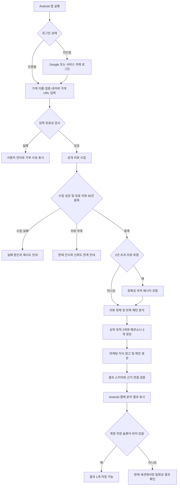

# PULSE 손님분석 기능명세서

## 1. 문서 개요

| 항목 | 내용 |
|---|---|
| 문서 목적 | PULSE의 손님분석 MVP를 구현하기 위한 화면, 기능, 상태, 데이터 및 인수 기준 정의 |
| 제품 요구사항 정본 | [`../PRD.md`](../PRD.md) |
| UI/UX 원칙 정본 | [`../../design/DESIGN_SYSTEM.md`](../../design/DESIGN_SYSTEM.md) |
| 대상 사용자 | 리뷰를 직접 분석할 시간과 전문지식이 부족한 외식업 자영업자 |
| 제공 형태 | Expo 기반 React Native·TypeScript Android 앱 |
| 핵심 가치 | 가게 지정 한 번으로 공개 리뷰를 분석해 손님 인식과 실행 가능한 운영·마케팅 제안을 근거와 함께 제공 |
| 문서 상태 | 개발 전 상세 기능명세 초안 |
| 소유 역할 | `role:product` |

이 문서는 PRD의 상세 명세다. 두 문서가 충돌하면 `PRD.md`가 우선한다. 실제 API 스키마, 타입, DB 마이그레이션이 생긴 뒤에는 해당 코드가 구현 계약의 정본이 된다.

첨부된 「PULSE 손님분석 안드로이드 앱 기능명세서」 초안을 바탕으로 하되, 현재 PRD에 맞춰 다음과 같이 조정했다.

- **Expo 기반 React Native·TypeScript Android 앱**을 기준으로 한다.
- Google 소셜 로그인과 서비스 자체 로그인을 MVP에 포함한다.
- 가게 분석 필수 입력은 가게 이름·업종·네이버 가게 URL 3개로 제한한다.
- 리뷰 수집 대상은 네이버 공개 리뷰로 한정한다.
- 계정당 분석 1개 저장은 포함하되 복수 저장 이력·월별 비교는 제외한다.
- 고객 여정 지도는 현재 PRD의 기능 요구사항이 아니므로 제외한다.
- RAG 기반 마케팅·운영 제안은 PRD의 P0 요구사항이므로 포함한다.
- 상위 토픽 3개에 대응하는 페르소나를 총 3개 생성한다.
- TOP3 페르소나 이미지는 OpenAI API로 모두 생성하며 P0 완료 조건으로 둔다.
- 모든 분석 결과에 근거 리뷰를 연결하고, 리뷰 사실과 AI 해석을 구분한다.

---

## 2. MVP 범위

### 2.1 포함 범위

| PRD 요구사항 | 기능 | 우선순위 |
|---|---|---:|
| FR-001 | 등록한 네이버 가게 URL에서 네이버 공개 리뷰 수집 | P0 |
| FR-002 | 긍정 신호·부정 신호·인식·우선순위 분석 | P0 |
| FR-003 | 리뷰에서 관찰 가능한 손님 유형 도출 | P0 |
| FR-004 | OpenAI API로 통일된 스타일의 TOP3 페르소나 이미지 3개 생성 | P0 |
| FR-005 | 리뷰 사실·AI 해석·전문 지식·제안을 연결한 운영·마케팅 제안 | P0 |
| FR-006 | 리뷰에서 확인된 사실과 AI 해석의 명시적 구분 | P0 |
| FR-007 | Expo 기반 React Native·TypeScript Android 앱 제공 | P0 |
| FR-008 | Google 소셜 로그인과 서비스 자체 로그인 | P0 |
| FR-009 | 분석 유효 리뷰 50건 기준과 2년 초과 리뷰 우려 메시지 | P0 |
| FR-010 | 가게 이름·업종·네이버 가게 URL 필수 입력 | P0 |

### 2.2 제외 범위

- 사용자 프로필과 복수 가게 관리
- 메뉴·가격·매출·대표 이미지 등 사장님의 추가 데이터 입력
- 리뷰 직접 입력과 CSV 업로드
- 복수 분석 저장 목록, 월별 비교, 재분석 버전 관리
- 고객 여정 지도
- 홍보영상 생성과 SNS 자동 업로드
- 인플루언서 추천·연결
- 경쟁 점포 비교
- 결제 및 구독
- 카카오맵 리뷰 수집·분석
- 매출 상승 예측 또는 보장

제외 항목이 필요해지면 먼저 PRD를 변경하고 별도 요구사항과 ADR을 작성한다.

---

## 3. 핵심 사용자 흐름



사용자가 제공하는 필수 매장 데이터는 **가게 이름, 업종, 네이버 가게 URL 3개**다. 업종은 한식·중식·일식·양식·카페/디저트·주점·기타 중 하나를 선택한다.

결과 확인 후 무엇을 실행할지 선택하는 행위는 인터뷰 측정 대상이며, 선택 저장이나 실행 추적 기능은 MVP에 포함하지 않는다.

---

## 4. 화면 구성

| 화면 ID | 화면명 | 핵심 기능 | 진입 조건 |
|---|---|---|---|
| SC-AUTH | 로그인 | Google 소셜 로그인, 서비스 자체 로그인, 인증 오류·세션 복원 | 미인증 상태 |
| SC-001 | 가게 정보 입력 | 가게 이름, 업종 선택, 네이버 가게 URL 입력 | 로그인 완료 |
| SC-002 | 가게 확인 | 입력 정보와 네이버 URL에서 확인한 가게 표시, 분석 시작 | 가게 식별 성공 |
| SC-003 | 분석 진행 | 현재 단계와 진행 상태 표시 | 분석 작업 생성 |
| SC-004 | 결과 요약 | 긍정·부정·인식·우선순위 요약 | 분석 성공 |
| SC-005 | 근거 상세 | 분석 항목에 연결된 익명 근거 리뷰 표시 | 결과 항목 선택 |
| SC-006 | 손님 유형 | 상위 토픽 3개, 페르소나 3개, 관찰 특성, 근거 리뷰, 한계 고지 | 분석 성공 |
| SC-007 | 페르소나 이미지 | OpenAI API로 생성한 통일된 스타일의 이미지 3개와 생성 사실 고지 | 이미지 3개 생성 성공 |
| SC-008 | 실행 제안 | 리뷰 사실·AI 해석·전문 지식 참고·제안 표시 | 분석 성공 |
| SC-009 | 오류·한계 | 잘못된 주소, 수집 실패, 리뷰 부족, 분석 실패 안내 | 각 실패 발생 |
| SC-010 | 결과 저장 상태 | 저장 가능, 저장 완료, 저장 슬롯 사용 중, 일회성 결과 안내 | 분석 성공 |

MVP는 위 화면을 단일 페이지의 단계 또는 섹션으로 구현할 수 있다. 라우트 분리는 기술 스택과 UX 설계가 확정된 뒤 결정한다.

---

## 5. 기능 요구사항

우선순위는 `P0: MVP 필수`, `P1: MVP 품질`, `P2: 후속 개선`으로 구분한다.

### 5.0 인증

| 요구사항 ID | 기능 | 상세 명세 | 우선순위 |
|---|---|---|---:|
| AUTH-001 | Google 로그인 | Android 앱에서 Google 인증을 수행하고 서버가 인증 결과를 검증한 뒤 서비스 세션을 발급한다. | P0 |
| AUTH-002 | 서비스 자체 로그인 | 서비스가 관리하는 이메일 형식 아이디와 비밀번호로 로그인할 수 있다. | P0 |
| AUTH-003 | 세션 복원 | 유효한 인증 정보가 있으면 앱 재실행 시 로그인 상태를 안전하게 복원한다. | P0 |
| AUTH-004 | 인증 실패 | 잘못된 자격 증명, 만료, 외부 인증 실패를 구분해 사용자 언어로 안내한다. | P0 |
| AUTH-005 | 로그아웃 | 기기의 서비스 인증 정보를 제거하고 로그인 화면으로 이동한다. | P0 |
| AUTH-006 | 서버 권한 검증 | 사용자 소유 데이터 API는 서버에서 사용자 권한을 검증한다. | P0 |
| AUTH-007 | 자체 계정 가입 정보 | 자체 계정 생성 시 이메일 형식 아이디·비밀번호·전화번호만 필수로 받는다. | P0 |
| AUTH-008 | 전화번호 목적 고지 | 전화번호 인증·계정 복구 사용 여부와 보관 목적을 사용자에게 고지한다. 구체 정책은 확정 필요다. | P0 |

### 5.1 가게 지정과 입력 검증

| 요구사항 ID | 기능 | 상세 명세 | 우선순위 |
|---|---|---|---:|
| INPUT-001 | 가게 이름 | 사용자가 분석할 가게 이름을 필수로 입력한다. | P0 |
| INPUT-002 | 업종 선택 | 한식·중식·일식·양식·카페/디저트·주점·기타 중 하나를 필수로 선택한다. | P0 |
| INPUT-003 | 네이버 가게 URL | 사용자가 분석할 네이버 가게 URL을 필수로 입력한다. | P0 |
| INPUT-004 | 임의 주소 접근 차단 | 리다이렉트 이후 주소를 포함해 허용되지 않은 호스트, 로컬·사설 IP, 비HTTP(S) 스킴에는 서버 브라우저가 접근하지 않는다. | P0 |
| INPUT-005 | 서버 측 허용 목록 | URL을 정규화한 뒤 확정된 네이버 지도·플레이스 도메인만 통과시킨다. | P0 |
| INPUT-006 | 입력 오류 안내 | 누락 필드, 허용되지 않은 업종, 지원하지 않는 URL, 식별할 수 없는 가게를 구분해 필드별로 안내한다. | P0 |
| INPUT-007 | 입력 정보 확인 | 네이버 URL에서 확인한 가게 정보와 사용자가 입력한 이름·업종이 크게 다르면 분석 전 확인을 요청한다. | P1 |

### 5.2 리뷰 수집과 비식별화

| 요구사항 ID | 기능 | 상세 명세 | 우선순위 |
|---|---|---|---:|
| REVIEW-001 | 공개 리뷰 수집 | 로그인 없이 접근할 수 있는 공개 리뷰만 수집한다. | P0 |
| REVIEW-002 | 네이버 수집기 분리 | 네이버 수집기를 공통 인터페이스 뒤에 두어 향후 다른 합법적 수집 경로로 교체할 수 있게 한다. | P0 |
| REVIEW-003 | 수집 메타데이터 | 플랫폼, 수집 건수, 수집 시점과 성공·실패 상태를 기록하고 결과에 표시한다. | P0 |
| REVIEW-004 | 작성자 식별정보 배제 | 닉네임, 프로필 링크, 프로필 이미지 URL, 계정 식별자를 파싱·저장·로그·표시 대상에서 제외한다. | P0 |
| REVIEW-005 | 중복 제거 | 작성자 정보가 아닌 정규화한 리뷰 본문 해시로 중복을 판별한다. | P0 |
| REVIEW-006 | 수집량 제한 | MVP 검증에 필요한 범위로 수집량과 빈도를 제한하며 대량·상시 수집을 하지 않는다. | P0 |
| REVIEW-007 | 최소 리뷰 수 판단 | 비식별화·중복·무효 리뷰 제외 후 분석 유효 리뷰가 50건 이상인지 판정한다. | P0 |
| REVIEW-008 | 리뷰 부족 처리 | 분석 유효 리뷰가 50건 미만이면 임의의 분석 결과를 만들지 않고 현재 건수와 50건 기준을 표시한다. | P0 |
| REVIEW-009 | 수집 실패 처리 | 페이지 변경, 접근 제한, 시간 초과, 가게 미발견을 구분 가능한 내부 오류로 기록하고 사용자에게 쉬운 문장으로 변환한다. | P0 |
| REVIEW-010 | 오래된 리뷰 감지 | 분석 시점 기준 2년보다 오래된 리뷰가 한 건 이상 포함됐는지 판정한다. | P0 |
| REVIEW-011 | 오래된 리뷰 우려 메시지 | 2년보다 오래된 리뷰가 포함되면 현재 매장 상태와 달라 분석이 부정확할 수 있다는 메시지를 결과에 표시한다. | P0 |

### 5.3 분석 작업

| 요구사항 ID | 기능 | 상세 명세 | 우선순위 |
|---|---|---|---:|
| ANALYSIS-001 | 분석 작업 생성 | 유효한 가게 지정 한 건으로 리뷰 수집부터 결과 생성까지 하나의 작업을 만든다. | P0 |
| ANALYSIS-002 | 비동기 처리 | 리뷰 수집과 AI 처리를 요청 응답과 분리해 백그라운드 작업으로 실행한다. | P0 |
| ANALYSIS-003 | 진행 상태 | 1초를 넘는 작업에는 현재 단계 또는 진행 중임을 표시한다. | P0 |
| ANALYSIS-004 | 4개 관점 분석 | 긍정 신호, 부정 신호, 가게 인식, 개선 우선순위를 모두 생성한다. | P0 |
| ANALYSIS-005 | 근거 필수 | 각 분석 항목에 하나 이상의 근거 리뷰를 연결한다. 근거가 없으면 해당 항목을 출력하지 않는다. | P0 |
| ANALYSIS-006 | 사실과 해석 분리 | 리뷰에서 직접 확인된 사실과 모델이 도출한 해석을 별도 필드로 생성한다. | P0 |
| ANALYSIS-007 | 편향 한계 고지 | 리뷰 작성자가 전체 고객을 대표하지 않으며 이벤트·자기선택 편향이 있을 수 있음을 결과에 표시한다. | P0 |
| ANALYSIS-008 | 구조화 응답 검증 | AI 응답은 버전이 있는 구조화 스키마로 검증하고, 검증 실패 시 제한된 횟수만 재시도한다. | P0 |
| ANALYSIS-009 | 실패 복구 | 수집 실패, 리뷰 부족, 모델 오류, 응답 검증 실패, 시간 초과를 구분해 재시도 가능 여부를 제공한다. | P0 |

### 5.4 손님 유형과 페르소나

| 요구사항 ID | 기능 | 상세 명세 | 우선순위 |
|---|---|---|---:|
| PERSONA-001 | 상위 토픽 선정 | 반복 빈도와 근거가 확인되는 상위 토픽 3개를 선정한다. | P0 |
| PERSONA-002 | 페르소나 3개 생성 | 상위 토픽마다 페르소나를 1개씩, 총 3개 생성한다. | P0 |
| PERSONA-003 | 관찰 범위 제한 | 리뷰에서 확인할 수 없는 연령, 성별, 직업 등 인구통계를 실제 고객 특성처럼 단정하지 않는다. | P0 |
| PERSONA-004 | 근거 리뷰 연결 | 각 유형에 해당 유형을 뒷받침하는 익명 근거 리뷰를 연결한다. | P0 |
| PERSONA-005 | 유형 한계 고지 | 페르소나는 실제 개인이나 전체 고객 대표가 아니라 리뷰 패턴을 이해하기 쉽게 표현한 결과임을 표시한다. | P0 |
| PERSONA-006 | 유형 비중 표현 | 충분한 근거가 있을 때만 분석 리뷰 내 관찰 비중을 표시하고, 실제 고객 구성 비율로 일반화하지 않는다. | P1 |
| PERSONA-007 | 근거 부족 처리 | 근거를 충족하는 토픽이 3개보다 적으면 페르소나를 임의로 채우지 않고 분석 불충분 상태를 반환한다. | P0 |

### 5.5 페르소나 이미지

| 요구사항 ID | 기능 | 상세 명세 | 우선순위 |
|---|---|---|---:|
| IMAGE-001 | OpenAI 이미지 생성 | TOP3 페르소나의 비식별 특성을 바탕으로 OpenAI API를 호출해 가상 이미지를 1개씩, 총 3개 생성한다. | P0 |
| IMAGE-002 | 스타일 일관성 | 세 이미지는 별도로 확정할 화풍·톤·구성 규칙을 따른다. 규칙 확정 전에는 완료로 판정하지 않는다. | P0 |
| IMAGE-003 | 생성 이미지 고지 | 실제 고객 사진이 아닌 AI 생성 이미지임을 명확하게 표시한다. | P0 |
| IMAGE-004 | 개인 재현 금지 | 실제 리뷰 작성자의 얼굴이나 특정 개인을 재현하도록 요청하지 않는다. | P0 |
| IMAGE-005 | 생성 실패 | 이미지 생성 실패 시 정해진 정책으로 재시도한다. 세 이미지가 모두 생성되기 전에는 MVP 분석 작업을 완료로 판정하지 않는다. | P0 |
| IMAGE-006 | 서버 전용 API 키 | OpenAI API 키를 Android 앱에 포함하거나 응답·로그에 노출하지 않고 서버에서만 관리한다. | P0 |

### 5.6 마케팅·운영 제안

| 요구사항 ID | 기능 | 상세 명세 | 우선순위 |
|---|---|---|---:|
| ADVICE-001 | 제안 생성 | 리뷰 분석과 손님 유형을 바탕으로 검토 가능한 운영·마케팅 행동 후보를 생성한다. | P0 |
| ADVICE-002 | 리뷰 사실 | 각 제안에 실제 리뷰에서 반복 확인된 사실을 포함한다. | P0 |
| ADVICE-003 | AI 해석 | 사실이 어떤 문제 또는 기회와 연결되는지 해석하되 사실과 다른 영역에 표시한다. | P0 |
| ADVICE-004 | 전문 지식 참고 | 검증된 마케팅 자료를 RAG로 참고하고 사용한 지식 근거를 추적할 수 있게 한다. | P0 |
| ADVICE-005 | 실행 제안 | 사장님이 검토할 수 있는 구체적 행동으로 표현한다. | P0 |
| ADVICE-006 | 최소 출력 구조 | 모든 제안에는 최소한 `리뷰 사실`과 `제안`이 함께 있어야 한다. | P0 |
| ADVICE-007 | 과장 방지 | 매출 상승, 재방문 증가 등 결과를 보장하는 표현을 사용하지 않는다. | P0 |
| ADVICE-008 | 근거 없는 제안 배제 | 리뷰 사실 또는 허용된 지식 근거로 뒷받침되지 않는 제안은 출력하지 않는다. | P0 |

### 5.7 Android 결과 화면

| 요구사항 ID | 기능 | 상세 명세 | 우선순위 |
|---|---|---|---:|
| RESULT-001 | 결과 요약 | 긍정·부정·인식·우선순위를 처음 보는 화면에서 빠르게 이해할 수 있게 표시한다. | P0 |
| RESULT-002 | 근거 탐색 | 각 분석 결과와 제안에서 연결된 익명 근거 리뷰를 확인할 수 있다. | P0 |
| RESULT-003 | 시각적 구분 | 리뷰 사실, AI 해석, 전문 지식 참고, 제안을 레이블과 표현 방식으로 구분한다. 색상만으로 구분하지 않는다. | P0 |
| RESULT-004 | 분석 기준 정보 | 수집 플랫폼, 리뷰 수, 수집 시점, 분석 완료 시점과 결과 한계를 표시한다. | P0 |
| RESULT-005 | Android 완료 | 지원 대상 Android 실제 기기 또는 에뮬레이터에서 전체 흐름을 완료할 수 있다. | P0 |
| RESULT-006 | 상태 완결성 | loading, empty, error, 정상 상태를 모두 제공한다. | P0 |
| RESULT-007 | 쉬운 표현 | 토픽 모델, 임베딩, RAG 같은 내부 용어 대신 사장님이 이해할 수 있는 표현을 사용한다. | P0 |
| RESULT-008 | 저장 한도 | 한 계정에 저장된 분석 결과가 최대 1개인지 서버와 DB 제약으로 보장한다. | P0 |
| RESULT-009 | 추가 분석 | 저장본이 있어도 새 분석 작업을 실행하고 결과를 확인할 수 있다. | P0 |
| RESULT-010 | 일회성 결과 | 저장 슬롯이 찬 상태에서 생성한 결과는 현재 인증 세션에 귀속하고 추가 저장을 거부한다. | P0 |
| RESULT-011 | 재로그인 삭제 | 로그아웃 후 재로그인하거나 새 로그인 세션이 만들어지면 이전 세션의 미저장 결과를 삭제하고 조회를 거부한다. 유효한 기존 세션을 복원한 앱 재실행은 새 로그인으로 보지 않는다. | P0 |

---

## 6. 분석 데이터 파이프라인

1. **가게 식별**
   - 가게 이름, 업종, 네이버 가게 URL을 검증하고 정규화한다.
   - URL에서 확인한 가게와 입력 정보가 크게 다르면 분석 전에 확인한다.
2. **리뷰 확보**
   - 네이버 수집 어댑터로 공개 리뷰만 수집한다.
   - 수집 시점부터 작성자 식별정보를 파싱 대상에서 제외한다.
3. **리뷰 정제**
   - 본문 정규화, 중복 해시 판별, 광고성·무의미 문구 탐지를 수행한다.
   - 제거 또는 제외한 리뷰 수와 사유를 내부 관측 정보로 남긴다.
4. **반복 패턴 분석**
   - 긍정·부정 신호와 반복 주제를 구조화한다.
   - 방문 목적과 사용 상황은 리뷰에 명시된 경우에만 관찰값으로 사용한다.
5. **손님 유형 생성**
   - 구조화된 반복 패턴과 근거 리뷰만 모델 입력으로 사용한다.
   - 인구통계 특성을 추론하지 않는다.
6. **전문 지식 검색과 제안 생성**
   - 검증된 지식 자료에서 관련 내용을 검색한다.
   - 리뷰 사실, AI 해석, 지식 근거, 제안을 분리해 생성한다.
7. **출력 검증**
   - 구조화 스키마, 근거 참조 무결성, 금지 표현을 검사한다.
   - 존재하지 않는 리뷰 ID나 지식 문서를 참조하면 결과를 거부하고 재시도한다.
8. **결과 제공**
   - 수집 건수·시점, 분석 결과, 근거와 한계를 함께 제공한다.
   - 페르소나 이미지 3개가 모두 생성되지 않으면 작업을 완료로 판정하지 않는다.
9. **결과 저장 또는 일회성 제공**
   - 계정의 저장 슬롯이 비어 있으면 정책에 따라 결과 1개를 저장한다.
   - 저장 슬롯이 차 있으면 결과를 현재 인증 세션에만 귀속하고 새 세션 시작 시 삭제한다.

Kiwi, BERTopic, 특정 임베딩·LLM 제품은 신청서상 계획이며 아직 확정 기술이 아니다. 기술 선택은 별도 ADR에서 결정한다.

---

## 7. 데이터 구조 초안

아래는 구현 논의를 위한 논리 모델이며 DB 스키마 확정안이 아니다.

| 엔티티 | 주요 필드 | 설명 |
|---|---|---|
| User | id, authProvider, providerSubject, loginEmail, credentialHash, phoneNumber, createdAt | Google 또는 서비스 자체 계정과 연결되는 사용자. 자체 계정 로그인 ID는 이메일 형식 |
| AuthSession | id, userId, refreshTokenHash, expiresAt, revokedAt | 세션 복원, 로그아웃, 일회성 결과 귀속을 위한 서버 측 세션 메타데이터 후보 |
| AnalysisJob | id, userId, sessionId, storeReference, status, progressStep, errorCode, requestedAt, startedAt, completedAt | 한 번의 분석 작업 |
| StoreReference | name, category, naverPlaceUrl, externalStoreId | 사용자가 입력한 가게 이름·업종·네이버 가게 URL과 외부 식별자 |
| Review | id, platform, content, rating, writtenAt, collectedAt, contentHash | 작성자 식별정보가 제거된 리뷰 |
| Insight | id, analysisId, kind, reviewFact, interpretation, priority | 4개 관점의 분석 항목 |
| EvidenceLink | insightId 또는 personaId 또는 adviceId, reviewId, excerpt | 결과와 근거 리뷰 연결 |
| Persona | id, analysisId, label, summary, observedNeeds, observedPainPoints, observedContexts, caveat | 리뷰 관찰 범위의 손님 유형 |
| PersonaImage | personaId, styleVersion, modelVersion, imageLocation, status | P0 생성 이미지 메타데이터 |
| Advice | id, analysisId, reviewFact, interpretation, suggestedAction | 운영·마케팅 제안 |
| KnowledgeReference | adviceId, sourceId, title, locator, retrievedAt | RAG에서 참고한 검증된 지식 근거 |
| Analysis | id, jobId, reviewCount, sourcePlatforms, collectedAt, schemaVersion, modelVersions, createdAt | 완료된 결과와 재현성 정보 |
| SavedAnalysis | userId, analysisId, savedAt | 계정당 하나만 허용하는 저장 연결. `userId`에 고유 제약 필요 |

저장 분석은 계정당 최대 1개다. 미저장 분석은 인증 세션에 귀속하고 새 로그인 세션 시작 시 삭제한다. 재로그인이 발생하지 않을 때의 최대 보관 시간과 저장본 삭제·교체 정책은 미정이다.

---

## 8. API 초안

API 경로와 필드는 기술 스택 확정 후 실제 OpenAPI/schema/types로 확정한다.

| Method | Endpoint | 설명 |
|---|---|---|
| POST | `/v1/auth/google` | Google 인증 결과 검증 및 서비스 세션 발급 |
| POST | `/v1/auth/login` | 서비스 자체 계정 로그인 |
| POST | `/v1/auth/refresh` | 서비스 세션 갱신 |
| POST | `/v1/auth/logout` | 현재 세션 폐기 |
| POST | `/v1/analysis-jobs` | 가게 이름·업종·네이버 가게 URL을 받아 수집·분석 작업 생성 |
| GET | `/v1/analysis-jobs/{jobId}` | 작업 상태, 현재 단계, 실패 사유 조회 |
| GET | `/v1/analyses/{analysisId}` | 완료된 분석, 손님 유형, 제안과 근거 조회 |
| PUT | `/v1/me/saved-analysis/{analysisId}` | 저장 슬롯이 비어 있을 때 분석 결과를 계정에 저장 |
| GET | `/v1/me/saved-analysis` | 계정에 저장된 분석 결과 1개 조회 |

저장 슬롯이 이미 사용 중이면 저장 API는 기존 저장본을 덮어쓰지 않고 `409 Conflict`를 반환한다. 삭제·교체 API는 정책이 확정되기 전까지 정의하지 않는다.

### 8.1 분석 작업 생성 예시

요청은 가게 이름, 업종, 네이버 가게 URL을 모두 받는다.

```json
{
  "storeName": "예시 식당",
  "category": "KOREAN",
  "naverPlaceUrl": "https://map.naver.com/..."
}
```

작업을 생성하면 완료를 기다리지 않고 `202 Accepted`와 작업 식별자를 반환한다.

```json
{
  "jobId": "job_...",
  "status": "QUEUED"
}
```

업종 API 값은 한식·중식·일식·양식·카페/디저트·주점·기타와 1:1로 대응하는 enum으로 정의한다. 실제 enum 이름은 schema/types에서 확정한다.

### 8.2 권한 정책

모든 사용자 소유 데이터는 서버에서 인증과 소유권을 확인한다. Android 앱의 화면 상태나 전달된 사용자 ID만 신뢰하지 않는다. 액세스·갱신 토큰 형식, 수명, 회전과 폐기 정책은 인증 설계에서 확정한다.

---

## 9. 작업 상태와 오류

### 9.1 분석 작업 상태

| 상태 | 의미 |
|---|---|
| QUEUED | 작업 대기 |
| RESOLVING_STORE | 가게 식별 중 |
| COLLECTING_REVIEWS | 공개 리뷰 수집 중 |
| PREPROCESSING | 비식별화·중복 제거·정제 중 |
| ANALYZING | 4개 관점과 손님 유형 분석 중 |
| RETRIEVING_KNOWLEDGE | 관련 마케팅 지식 검색 중 |
| GENERATING_ADVICE | 운영·마케팅 제안 생성 중 |
| GENERATING_IMAGE | TOP3 페르소나 이미지 3개 생성 중 |
| VALIDATING_RESULT | 스키마와 근거 연결 검증 중 |
| COMPLETED | 분석 완료 |
| FAILED | 복구 불가능한 실패 |

### 9.2 대표 오류 코드

| 오류 코드 | HTTP 예시 | 사용자 안내 원칙 |
|---|---:|---|
| INVALID_INPUT | 400 | 가게 이름·업종·네이버 가게 URL 중 잘못된 필드를 안내 |
| UNSUPPORTED_MAP_URL | 400 | 지원하는 네이버 가게 주소를 입력해 달라고 안내 |
| STORE_NOT_FOUND | 404 | 가게를 찾지 못했으며 이름 또는 주소 확인을 안내 |
| REVIEW_COLLECTION_BLOCKED | 422 | 현재 플랫폼에서 리뷰를 가져올 수 없다고 안내 |
| REVIEW_COLLECTION_FAILED | 502 | 일시적 수집 실패와 재시도 가능 여부 안내 |
| REVIEW_NOT_ENOUGH | 422 | 현재 리뷰 수와 분석 기준, 신뢰도 한계 안내 |
| ANALYSIS_TIMEOUT | 504 | 처리가 지연됐으며 다시 확인하거나 재시도하도록 안내 |
| MODEL_RESPONSE_INVALID | 502 | 결과 검증 실패와 자동 재시도 여부 안내 |
| RESULT_EVIDENCE_INVALID | 502 | 근거 연결 검증에 실패해 결과를 제공하지 못한다고 안내 |
| IMAGE_GENERATION_FAILED | 502 | 생성 실패와 재시도 가능 여부를 안내하고 완료 상태로 처리하지 않음 |

내부 오류 원문, 스택 트레이스, 외부 서비스 응답 전문을 사용자 화면에 노출하지 않는다.

---

## 10. 비기능 요구사항

### 10.1 개인정보와 보안

- 공개 리뷰만 처리한다.
- Google 인증 결과는 서버에서 검증한다.
- 서비스 자체 로그인 비밀번호를 평문 또는 복호화 가능한 형태로 저장하지 않는다.
- Android 앱에는 인증 토큰을 플랫폼의 안전한 저장소에 보관한다.
- 리뷰 작성자 닉네임, 계정 ID, 프로필 URL, 프로필 이미지를 저장·표시하지 않는다.
- 로그와 오류 추적 시스템에도 리뷰 작성자 식별정보를 남기지 않는다.
- 외부 AI 및 플랫폼 관련 비밀키는 서버에서만 관리한다.
- OpenAI API 키를 Android 앱 번들, Git, 클라이언트 로그 또는 API 응답에 포함하지 않는다.
- 모든 외부 통신은 HTTPS를 사용한다.
- 지도 URL은 DNS 확인과 리다이렉트 이후에도 허용 호스트인지 검사한다.
- 수집 브라우저는 내부망, 메타데이터 엔드포인트, 파일 스킴에 접근할 수 없어야 한다.
- RAG 문서는 승인된 지식베이스에서만 검색하며 사용자 입력을 시스템 지침으로 실행하지 않는다.
- 원본 리뷰, 중간 산출물, 분석 결과의 보관 기간과 삭제 정책을 구현 전에 결정한다.

### 10.2 성능과 안정성

- 1초를 넘는 작업은 진행 상태를 제공한다.
- 전체 목표 처리 시간은 PRD Open Question이므로 확정 전 숫자를 약속하지 않는다.
- 외부 플랫폼과 모델 호출에는 시간 제한, 제한된 재시도, 실패 격리를 적용한다.
- 같은 작업이 중복 실행되지 않도록 멱등성 또는 중복 방지 정책을 둔다.
- 수집기 하나의 실패가 다른 플랫폼 수집기나 기존 결과를 손상시키지 않게 한다.
- 사용한 수집기·스키마·프롬프트·모델 버전을 결과와 함께 추적할 수 있게 한다.

### 10.3 결과 품질

- 근거 없는 분석 항목과 제안은 사용자에게 표시하지 않는다.
- 근거 리뷰 참조는 실제 분석 입력에 포함된 리뷰만 가리켜야 한다.
- 동일한 사실을 리뷰 사실과 AI 해석 양쪽에 중복해 확신도를 부풀리지 않는다.
- 인구통계 추론과 매출 상승 보장 표현을 자동 검사한다.
- 리뷰가 편향된 표본이라는 한계를 결과에서 숨기지 않는다.

### 10.4 사용성과 접근성

- 전문 용어보다 점주가 이해하기 쉬운 문장을 사용한다.
- 키보드만으로 가게 지정부터 결과 확인까지 완료할 수 있어야 한다.
- 포커스 표시, 입력 레이블, 이미지 대체 텍스트를 제공한다.
- loading, empty, error, 정상 상태를 모두 구현한다.
- 색상만으로 사실·해석·상태를 구분하지 않는다.
- 최소 Android OS 버전과 지원 기기 범위는 구현 전 확정한다.

---

## 11. 핵심 인수 테스트

### AC-01 가게 지정 한 번으로 분석 시작

- **Given** 사용자가 Google 또는 서비스 자체 계정으로 로그인했고
- **When** 유효한 가게 이름, 허용 업종, 네이버 가게 URL을 입력하면
- **Then** 메뉴·가격·매출 등 추가 필수 정보 없이 수집·분석 작업이 생성되어야 한다.

### AC-02 허용되지 않은 URL 차단

- **Given** 사용자가 허용된 네이버 지도·플레이스 도메인 밖의 URL을 입력했고
- **When** 분석을 요청하면
- **Then** 서버는 해당 URL에 접속하지 않아야 한다.
- **And** 사용자가 이해할 수 있는 거부 사유를 반환해야 한다.

### AC-03 리뷰 수집 투명성

- **Given** 공개 리뷰 수집이 완료됐고
- **When** 사용자가 결과를 확인하면
- **Then** 네이버 수집 건수와 수집 시점이 표시되어야 한다.
- **And** 작성자 식별정보는 저장되거나 표시되지 않아야 한다.

### AC-04 리뷰 부족

- **Given** 분석 유효 리뷰가 50건보다 적고
- **When** 분석 단계에 도달하면
- **Then** 임의의 인사이트·페르소나·제안을 생성하지 않아야 한다.
- **And** 현재 유효 리뷰 수와 50건 기준을 표시해야 한다.

### AC-05 4개 관점과 근거

- **Given** 충분한 리뷰로 분석이 성공했고
- **When** 결과를 조회하면
- **Then** 긍정 신호, 부정 신호, 가게 인식, 우선순위가 모두 제공되어야 한다.
- **And** 모든 표시 항목에는 하나 이상의 실제 근거 리뷰가 연결되어야 한다.

### AC-06 토픽별 페르소나 3개와 추론 제한

- **Given** 손님 유형이 생성됐고
- **When** 유형 상세를 조회하면
- **Then** 상위 토픽 3개와 토픽별 페르소나 1개씩 총 3개가 제공되어야 한다.
- **And** 각 페르소나에 하나 이상의 근거 리뷰가 연결되어야 한다.
- **And** 리뷰로 확인되지 않은 연령·성별·직업을 단정형으로 표시하지 않아야 한다.

### AC-07 사실과 AI 해석 구분

- **Given** 분석 결과와 제안이 생성됐고
- **When** 사용자가 결과를 읽으면
- **Then** 리뷰에서 확인된 사실과 AI 해석을 레이블과 구조로 구분할 수 있어야 한다.
- **And** 모든 제안에는 최소한 리뷰 사실과 실행 제안이 함께 있어야 한다.

### AC-08 TOP3 이미지 완료

- **Given** 상위 토픽 3개와 페르소나 3개가 생성됐고
- **When** 이미지 생성 단계가 완료되면
- **Then** 각 페르소나에 대응하는 OpenAI 생성 이미지가 1개씩 총 3개 있어야 한다.
- **And** 하나라도 생성되지 않았으면 작업을 완료로 판정하지 않고 실패와 재시도 가능 여부를 표시해야 한다.

### AC-09 Android 앱 완료

- **Given** 지원 대상 Android 실제 기기 또는 에뮬레이터에서 앱을 실행했고
- **When** 가게 지정부터 결과 확인까지 진행하면
- **Then** 가게 지정부터 결과 확인까지 전체 흐름을 완료할 수 있어야 한다.
- **And** 응답 없는 정지 화면 없이 진행 상태를 확인할 수 있어야 한다.

### AC-10 로그인 방식

- **Given** 유효한 Google 계정 또는 서비스 자체 계정이 있고
- **When** 각 로그인 방식을 사용하면
- **Then** 서버 검증 후 앱 세션이 생성되어야 한다.
- **And** 앱 재실행 시 유효한 세션을 안전하게 복원해야 한다.

### AC-11 오래된 리뷰 경고

- **Given** 분석 유효 리뷰가 50건 이상이고 분석 시점보다 2년 넘게 오래된 리뷰가 포함됐고
- **When** 결과를 조회하면
- **Then** 과거 리뷰 때문에 현재 매장 상태와 달라 분석이 부정확할 수 있다는 우려 메시지가 표시되어야 한다.

### AC-12 계정당 저장 1개와 일회성 분석

- **Given** 계정에 저장된 분석 결과가 없고
- **When** 저장 가능한 분석 결과를 저장하면
- **Then** 계정의 저장 결과가 1개가 되어야 한다.
- **Given** 계정에 저장 결과가 이미 1개 있고
- **When** 새 분석을 실행하면
- **Then** 분석과 현재 세션 내 조회는 허용하되 추가 저장은 거부해야 한다.
- **And** 새 로그인 세션이 시작되면 이전 세션의 미저장 분석 결과를 삭제하고 조회를 거부해야 한다.

---

## 12. 개발 전 확정할 항목

PRD의 Open Questions와 직접 연결되는 결정이다.

| 항목 | 결정 시점 | 막고 있는 구현 |
|---|---|---|
| 전체 기술 스택과 저장소 구조 | 코드 작성 전 | 프로젝트 생성, 실행 명령, CI |
| 백엔드와 AI 처리 경계 | 코드 작성 전 | API 호출 구조, 배포 단위 |
| Expo SDK·React Native 버전과 development build 사용 여부 | 앱 프로젝트 생성 전 | 화면 구조와 빌드 방식 |
| Python 프레임워크와 Spring Boot 호출 경계 | 백엔드 구조 확정 전 | 서비스 경계와 배포 단위 |
| 목표 처리 시간 | 아키텍처 확정 전 | 타임아웃, 작업 큐, UX |
| 최소 Android OS·지원 기기 | UI 구현 전 | RESULT-005, AC-09 |
| 페르소나 이미지 스타일 규칙 | FR-004 구현 전 | IMAGE-002 |
| OpenAI 이미지 모델·크기·비용·재시도 | FR-004 구현 전 | IMAGE-001, IMAGE-005 |
| RAG 지식베이스 출처와 승인 절차 | ADVICE 구현 전 | ADVICE-004, ADVICE-008 |
| 원본 리뷰·중간 산출물·결과 보관 기간 | 저장 계층 구현 전 | 개인정보·삭제 정책 |
| 전화번호 인증·계정 복구·탈퇴 정책 | 인증 구현 전 | AUTH-002~008 |
| 비밀번호 규칙·전화번호 중복 가입 정책 | 인증 구현 전 | AUTH-002, AUTH-007 |
| 인증 토큰 수명·회전·폐기 정책 | 인증 구현 전 | 접근 통제와 세션 복원 |
| 작성일 미확인 리뷰의 경고 처리 | FR-009 구현 전 | REVIEW-010~011 |
| 허용 네이버 URL 도메인 목록 | 수집기 구현 전 | INPUT-003~005 |
| 주소·대표 메뉴·최근 매장 변경 시점의 선택 입력 여부 | 입력 화면 확정 전 | PRD Open Questions |
| `기타` 업종 세부값 입력 여부 | 입력 화면 확정 전 | INPUT-002 |
| 이용약관·개인정보 처리 동의와 이력 보관 | 회원가입 구현 전 | AUTH-007 |
| 분석 자동 저장 또는 명시적 저장 선택 | 결과 화면·API 구현 전 | RESULT-008 |
| 저장본 삭제·교체 허용 여부 | 결과 저장 API 구현 전 | RESULT-008 |
| 동시 분석 작업 수와 일회성 결과 최대 보관 시간 | 작업 큐·삭제 배치 구현 전 | RESULT-009~011 |
| 수집 정책 재검토 조건의 운영 절차 | 수집기 구현 전 | 차단·이의 제기 대응 |

---

## 13. 구현 권장 경계

기술 스택과 무관하게 다음 책임을 분리한다.

```text
Expo Android App
  → Analysis API
      → Store Resolver
      → Review Collector Interface
          ├─ Naver Collector
          └─ Test/Sample Collector
      → Review Sanitizer
      → Insight and Persona Analyzer
      → Knowledge Retriever
      → Advice Generator
      → Result Validator
      → Result Store
```

- 수집 계층은 플랫폼 차단이나 향후 계정 연동 전환에 대비해 교체 가능해야 한다.
- 분석 계층은 수집 방법을 알지 않아야 한다.
- 제안 생성 계층은 근거가 연결된 구조화 분석 결과만 받아야 한다.
- 테스트에서는 실제 플랫폼 수집 없이 고정된 비식별 예시 리뷰로 전체 흐름을 검증할 수 있어야 한다.
- 공개 API와 내부 AI 모듈을 별도 서버로 나눌지는 기술 스택 ADR에서 결정한다.

---

## 14. 요구사항 추적표

| PRD | 상세 요구사항 |
|---|---|
| FR-001 | INPUT-003~007, REVIEW-001~006, REVIEW-009 |
| FR-002 | ANALYSIS-004~009, RESULT-001~004 |
| FR-003 | PERSONA-001~007 |
| FR-004 | IMAGE-001~006 |
| FR-005 | ADVICE-001~008 |
| FR-006 | ANALYSIS-006, ADVICE-002~003, RESULT-003 |
| FR-007 | RESULT-001~007 |
| FR-008 | AUTH-001~008 |
| FR-009 | REVIEW-007~008, REVIEW-010~011 |
| FR-010 | INPUT-001~007 |
| FR-011 | RESULT-008~011 |

---

## 15. 변경 및 협업 규칙

- 기능 범위 변경은 먼저 `PRD.md`에 반영하거나 `role:product`와 합의한다.
- 요구사항을 구현하는 이슈와 PR에는 관련 요구사항 ID를 적는다.
- API나 데이터 구조가 바뀌면 실제 schema/types/migration을 먼저 갱신하고 이 문서를 동기화한다.
- 수집 방식의 위험과 준수사항은 [`../../decisions/ADR-002-review-collection.md`](../../decisions/ADR-002-review-collection.md)를 따른다.
- 구현 완료 표시는 실제 코드와 검증 결과가 있을 때만 사용한다.
- 확인하지 않은 기능, 테스트, 플랫폼 지원 상태를 완료로 기록하지 않는다.
