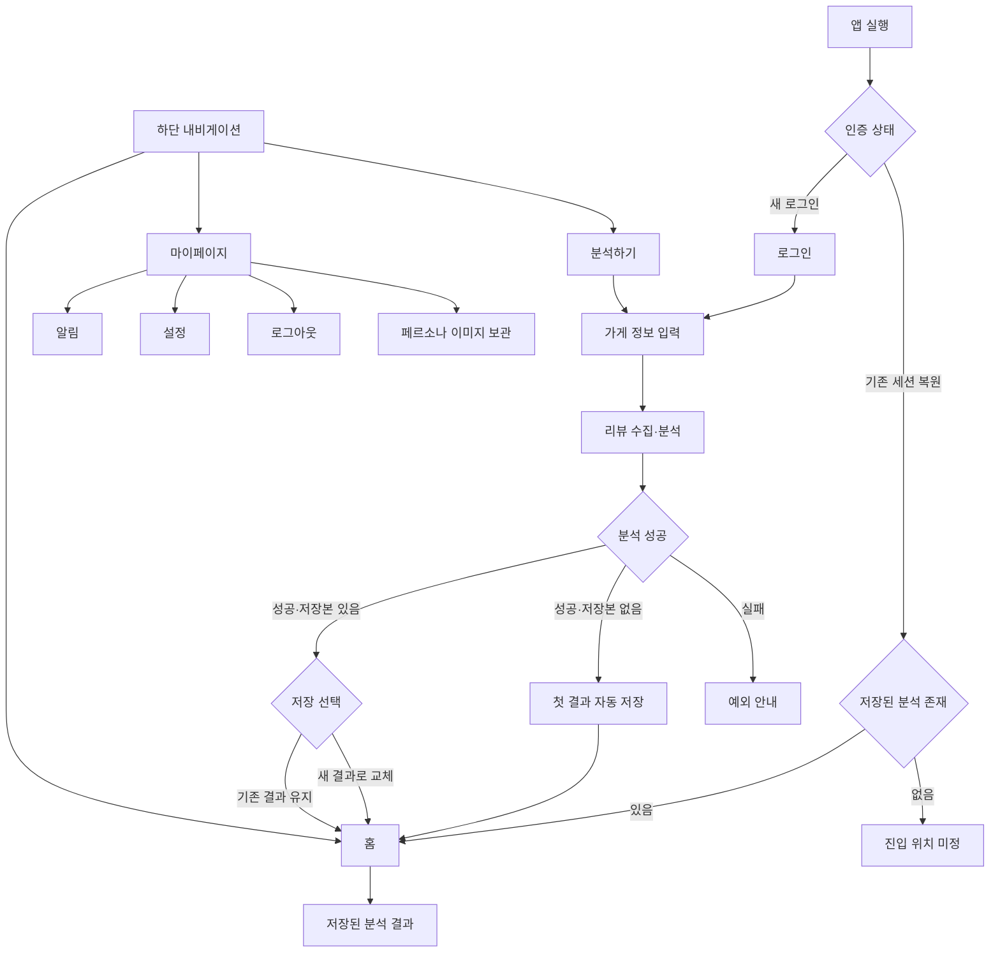
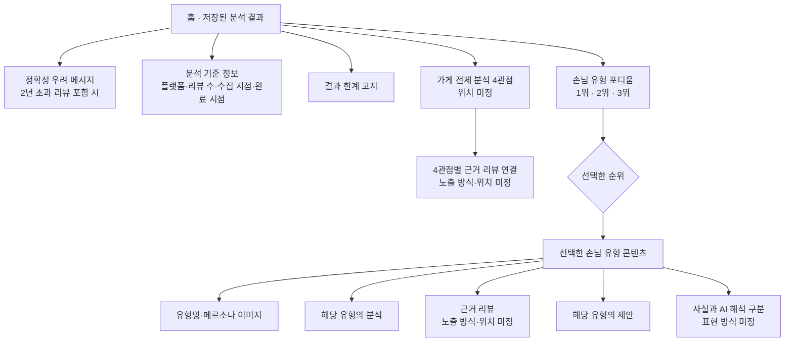

# PULSE MVP 정보구조(IA)

## 1. 문서 개요

| 항목 | 내용 |
|---|---|
| 목적 | 로그인부터 분석 결과 탐색·저장·재분석까지 앱의 정보구조를 정의하고, 결과 화면의 확정 결정과 미정 사항을 분리한다 |
| 상태 | 진행 중 결정 기록 |
| 기준일 | 2026-09-13 |
| 제품 요구사항 정본 | [PRD.md](../PRD.md) |
| 사용자 흐름 | [USER_FLOW.md](USER_FLOW.md) |
| 상세 기능명세 | [GUEST_ANALYSIS_FUNCTIONAL_SPEC.md](GUEST_ANALYSIS_FUNCTIONAL_SPEC.md) |
| UI/UX 원칙 | [DESIGN_SYSTEM.md](../../design/DESIGN_SYSTEM.md) |
| 소유 역할 | `role:product` |

이 문서는 완결된 화면설계서가 아니다. 아래 표기만 사용한다.

- **확정**: 제품 구조로 사용한다.
- **미정**: 사용자 또는 팀의 후속 결정이 필요하다.
- **제안(미확정)**: 검토 후보이며 현재 제품 요구사항에 적용하지 않는다.

## 2. 앱 전체 IA



### 구조 원칙

1. 새 로그인에 성공하면 홈보다 먼저 가게 이름·업종·네이버 가게 URL을 입력한다.
2. 홈은 현재 계정에 저장된 분석 결과 1개를 보여준다. 유효 세션은 있지만 저장 결과가 없는 경우의 진입 위치는 미정이다.
3. 첫 분석 결과는 자동 저장한다.
4. 저장본이 있는 상태에서 새 분석이 끝나면 사용자가 `새 결과로 교체` 또는 `기존 결과 유지`를 선택한다.
5. 하단 내비게이션 항목은 `홈`·`분석하기`·`마이페이지`다. 세 항목의 시각적 순서는 미정이다.
6. 마이페이지에는 승인된 `알림`·`설정`·`로그아웃`·`페르소나 이미지 보관`만 둔다. 각 항목의 세부 기능은 미정이다.

## 3. 결과 화면 IA

### 3.1 구조도



`분석 기준 정보`, `결과 한계 고지`, `유형명·페르소나 이미지`, `분석`, `근거 리뷰`, `제안`, `사실과 AI 해석 구분`은 결과에 필요한 정보다. 가게 전체 4관점 각각과 유형별 결과에는 근거 리뷰가 연결되어야 한다. 다만 각 정보의 정확한 표시 위치·순서와 기본 노출 범위는 아직 정하지 않았다.

### 3.2 계층 구조

```text
PULSE 앱
├─ 로그인
│  ├─ Google 로그인
│  └─ 서비스 자체 로그인
├─ 가게 정보 입력
│  ├─ 가게 이름
│  ├─ 업종
│  └─ 네이버 가게 URL
└─ 인증 후 영역
   ├─ 홈
   │  └─ 저장된 분석 결과
   │     ├─ 분석 기준 정보
   │     │  ├─ 수집 플랫폼
   │     │  ├─ 리뷰 수
   │     │  ├─ 수집 시점
   │     │  └─ 분석 완료 시점
   │     ├─ 결과 한계 고지
   │     ├─ [미정] 가게 전체 분석 4관점의 위치
   │     │  └─ 4관점별 근거 리뷰 연결
   │     ├─ 손님 유형 포디움
   │     │  ├─ 1위 유형 탭
   │     │  ├─ 2위 유형 탭
   │     │  └─ 3위 유형 탭
   │     └─ 선택한 유형 콘텐츠
   │        ├─ 유형명·페르소나 이미지
   │        ├─ 유형별 분석
   │        ├─ [미정] 근거 리뷰 노출 방식
   │        ├─ 유형별 제안
   │        └─ [미정] 사실과 AI 해석의 표현 방식
   ├─ 분석하기
   │  ├─ 가게 정보 입력
   │  ├─ 리뷰 수집·분석
   │  └─ 저장본 교체 또는 유지
   └─ 마이페이지
      ├─ 알림
      ├─ 설정
      ├─ 로그아웃
      └─ 페르소나 이미지 보관
```

## 4. 결과 화면 확정 결정

| ID | 확정 내용 | IA 반영 |
|---|---|---|
| D1 | 결과 화면은 탭 구조이며 탭 안에서 세로로 스크롤한다 | 포디움 아래의 선택 유형 콘텐츠를 세로 탐색 영역으로 둔다 |
| D2 | 탭의 축은 손님 유형이며, 화면 상단의 1·2·3위 포디움 각 순위가 탭 역할을 한다 | 별도의 탭 바를 추가하지 않는다 |
| D3 | 손님 유형은 정확히 3개로 고정한다 | 포디움 슬롯을 1·2·3위로 구성한다 |
| D4 | 순위는 토픽별 리뷰 수가 많은 순서다 | 순위 의미를 인기도나 매출 기여도가 아닌 리뷰 수로 한정한다 |
| D5 | 순위를 선택하면 해당 유형의 분석과 제안이 포디움 아래에서 하나씩 세로로 이어지고, 아래 내용만 교체된다 | 포디움을 공통 선택 영역으로 유지한다 |
| D6 | 리뷰 분석과 제안은 독립 탭이 아니라 각 손님 유형의 하위다 | `리뷰 분석 / 손님 유형 / 제안` 병렬 3탭 구조는 사용하지 않는다 |

여기서 포디움이 `고정`된다는 것은 유형을 바꿀 때 선택 영역은 유지되고 아래 콘텐츠가 교체된다는 뜻으로 기록한다. 화면을 스크롤할 때 포디움을 상단에 붙여 두는 sticky 동작까지 확정한 것은 아니다.

## 5. 주요 화면과 상태

| 화면·상태 | 확정 정보 | 아직 정하지 않은 것 |
|---|---|---|
| 로그인 | Google 로그인, 서비스 자체 로그인 | 로그인 화면의 상세 배치 |
| 가게 정보 입력 | 가게 이름, 업종, 네이버 가게 URL | 필드 배치와 입력 보조 방식 |
| 수집·분석 | 네이버 공개 리뷰 수집·분석 | 대기 화면 구성과 진행 정보 |
| 분석 실패 | 수집 실패, 리뷰 부족, 허용 도메인 밖 URL을 처리해야 함 | 각 예외의 화면 내 배치와 복구 동선 |
| 홈 | 저장된 분석 결과 1개와 수집 플랫폼·리뷰 수·수집 시점·분석 완료 시점·결과 한계 표시 | 가게 전체 분석 위치, 결과 세부 위계, 유효 세션이나 저장본이 없는 경우의 진입 위치 |
| 손님 유형 결과 | 3개 포디움 탭, 유형별 분석·제안 세로 탐색 | 최초 선택 순위, 근거 리뷰·라벨·사실/해석 표현, 제안 기본 노출 범위 |
| 분석 불충분 | 근거를 충족하는 토픽이 3개보다 적으면 페르소나를 임의로 채우지 않고 분석 불충분 상태를 반환 | 3칸 포디움을 표시하지 않을지, 별도 불충분 화면을 둘지 |
| 저장 선택 | 새 결과로 교체 또는 기존 결과 유지 | 선택 UI의 화면 형식과 문구 |
| 마이페이지 | 알림, 설정, 로그아웃, 페르소나 이미지 보관 | 각 항목의 세부 기능·정책 |

## 6. 미정 사항

다음 항목은 구조를 완성하려면 후속 결정이 필요하지만, 이 문서에서 임의로 채우지 않는다.

1. PRD FR-002의 가게 전체 4관점인 `긍정 신호`·`부정 신호`·`인식`·`우선순위`를 홈 결과의 어디에 둘지
2. 근거를 충족하는 토픽이 3개보다 적어 분석 불충분 상태가 반환될 때 3칸 포디움과 어떤 관계로 표현할지
3. 유형별 최소 리뷰 수 기준을 도입할 경우 3위가 기준에 미달했을 때 포디움 3번 칸을 비울지, 경고와 함께 노출할지
4. 유효 세션은 있지만 저장된 분석이 없는 경우 홈의 empty 상태를 보여줄지 가게 정보 입력으로 보낼지
5. 가게 지정 화면과 수집·분석 대기 화면의 상세 구성
6. 근거 리뷰의 기본 노출 여부와 상세 진입 방식
7. 리뷰에서 확인된 사실과 AI 해석을 구분하는 IA 표현
8. PRD FR-005의 제안 4레이어 중 기본 화면에 노출할 범위와 내부 위계
9. 수집 실패·리뷰 부족·허용 도메인 밖 URL 등 예외 상태의 배치
10. 결과 화면 라벨 체계
11. 포디움 진입 시 처음 선택할 순위
12. 하단 내비게이션 세 항목의 시각적 순서
13. 알림·설정·페르소나 이미지 보관의 세부 기능과 정책

## 7. 제안(미확정) — 최소 리뷰 수 구간

아래 값은 **현재 요구사항이 아니며 IA에 적용하지 않는다.** PRD FR-009의 현재 확정값은 `분석 유효 리뷰 50건 미만이면 분석을 시작하지 않는다`이다.

| 리뷰 수 | 제안 상태 |
|---|---|
| 50건 이상 | 정상 제공 |
| 30~49건 | 제공하되 신뢰도 경고를 상시 노출 |
| 30건 미만 | 포디움 3칸을 채울 수 없어 구조가 성립하지 않음 |
| 유형당 10건 미만 | 해당 순위에 경고 표시 |

근거는 [FINAL_RESEARCH_REPORT.md §9](../../../research/FINAL_RESEARCH_REPORT.md)의 `E-R09, B급`이다. 해당 문서는 미국 Yelp 연구에서 리뷰 50개 이상 매장이 10개 미만 매장보다 별점의 매출 효과가 50% 컸으며 최소 리뷰 수 설계에 참고할 수 있다고 기록했다.

그러나 다음 한계가 있다.

- 미국·Yelp·2000년대 데이터이며 국내 음식점에 그대로 전이되는지 검증되지 않았다.
- 원 연구가 측정한 것은 분석 안정성이 아니라 별점과 매출 효과의 크기다.
- 같은 문서 [§14 G6](../../../research/FINAL_RESEARCH_REPORT.md)은 신뢰 가능한 최소 리뷰 수를 미해소 공백으로 두고, 자체 표본 수집과 리뷰 수 구간별 분석 안정성 시뮬레이션을 해소 방법으로 제안한다.

따라서 이 구간은 PRD 1단계 테스트에서 실측한 값으로 교체해야 할 잠정 제안이다.

## 8. PRD 정합성

| 항목 | 현재 상태 |
|---|---|
| 손님 유형 개수 | 정상 결과는 현재 PRD FR-003과 D3 모두 `정확히 3개`다. 다만 유효 토픽이 3개보다 적을 때 PRD는 임의로 채우지 않고 분석 불충분 상태를 요구하므로 포디움과의 관계는 미정이다 |
| 가게 단위 4관점 | PRD FR-002는 필요 정보로 확정했지만, 유형별 구조와 별도로 어디에 둘지는 미정이다 |
| 최소 리뷰 수 | 현재 PRD FR-009는 가게 단위 유효 리뷰 50건을 확정했다. §7의 30~49건 제공 제안은 충돌하므로 적용하지 않는다 |
| 유형 부족·최소 건수 | `3개 고정`은 근거가 충분한 정상 결과에 적용한다. 유효 토픽 3개 미만의 분석 불충분 상태 및 향후 유형별 최소 건수와 3칸 포디움의 관계는 미정이다 |

## 9. 참고 실행값 — 확정값 아님

[발표 자료 생성 코드](../../presentation/generate.py)에는 실제 파이프라인 결과 예시로 토픽이 부여된 리뷰 59건과 상위 4개 유형이 기록되어 있다.

| 유형 | 기록된 비중 | 59건을 곱한 계산값 |
|---|---:|---:|
| 추억 재방객 | 30.6% | 약 18건 |
| 맵찔이 매니아 | 25.0% | 약 15건 |
| 혼밥 얼큰족 | 22.2% | 약 13건 |
| 중간맵기 탐색자 | 13.9% | 약 8건 |

건수는 비중에 59를 곱해 반올림한 **계산값이며 공표값이 아니다.** [발표 자료 README](../../presentation/README.md)도 원 로그가 보장하는 범위를 `59건에 topic info 추가`와 상위 4개 유형의 이름·비율까지로 제한한다. 이 실행 결과는 4유형이고 현재 제품 결정은 3유형 고정이므로 서로 다르다.

초기 요청에서 언급된 `docs/presentation/발표대본_중간발표_5분.md` 파일은 현재 저장소에서 확인되지 않았다. 위 수치는 실제로 확인한 `generate.py`와 `README.md`만을 근거로 기록했다.

## 10. 검증 기록

| 검증 항목 | 상태 |
|---|---|
| 확정·미정·제안 분리 | 확인 |
| PRD FR-002·FR-003·FR-005·FR-006·FR-009와 대조 | 확인 |
| E-R09 근거 등급과 문맥 | 확인 — B급으로 유지 |
| 59건 실행값 원문 | 확인 — 생성 코드와 발표 README 대조 |
| 상대 링크 | 확인 — 연결된 파일 기준 깨진 링크 0 |
| 애플리케이션 코드 검증 | 미실행 — 문서 작업이며 애플리케이션 코드 없음 |
