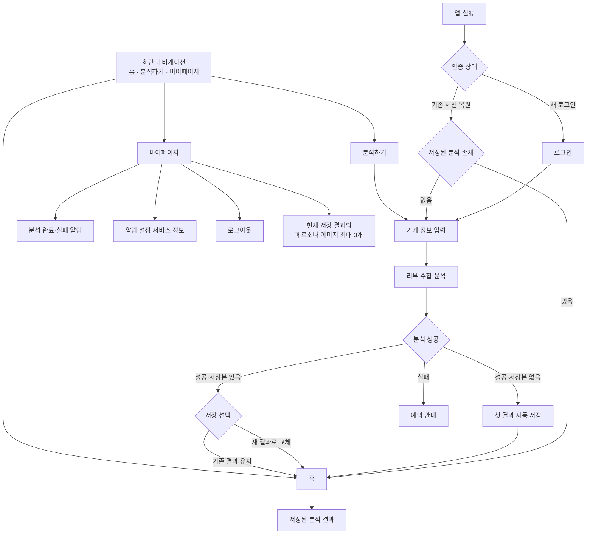
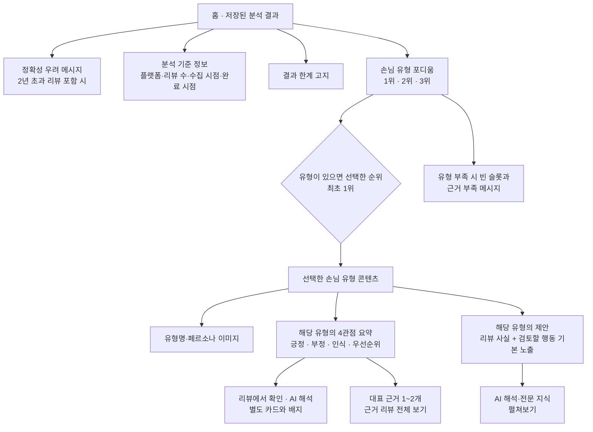

# PULSE MVP 정보구조(IA)

## 1. 문서 개요

| 항목 | 내용 |
|---|---|
| 목적 | 로그인부터 분석 결과 탐색·저장·재분석까지 앱의 정보구조를 정의하고, 결과 화면의 확정 결정과 미정 사항을 분리한다 |
| 상태 | 핵심 결과 IA 확정 / 세부 화면 설계 전 |
| 기준일 | 2026-09-15 |
| 제품 요구사항 정본 | [PRD.md](../PRD.md) |
| 사용자 흐름 | [USER_FLOW.md](USER_FLOW.md) |
| 상세 기능명세 | [GUEST_ANALYSIS_FUNCTIONAL_SPEC.md](GUEST_ANALYSIS_FUNCTIONAL_SPEC.md) |
| UI/UX 원칙 | [DESIGN_SYSTEM.md](../../design/DESIGN_SYSTEM.md) |
| 소유 역할 | `role:product` |

이 문서는 완결된 화면설계서가 아니다. 아래 표기만 사용한다.

- **확정**: 제품 구조로 사용한다.
- **미정**: 사용자 또는 팀의 후속 결정이 필요하다.
- **제안(미확정)**: 검토 후보이며 현재 제품 요구사항에 적용하지 않는다.

## 2. 앱 전체 IA



### 구조 원칙

1. 새 로그인에 성공하면 홈보다 먼저 가게 이름·업종·네이버 가게 URL을 입력한다.
2. 새 로그인 또는 기존 세션 복원 후 저장 결과가 없으면 홈으로 진입시키지 않고 가게 정보 입력으로 보낸다. 첫 분석을 완료해야 인증 후 주요 영역으로 진입할 수 있다.
3. 첫 분석 결과는 자동 저장한다.
4. 저장본이 있는 상태에서 새 분석이 끝나면 사용자가 `새 결과로 교체` 또는 `기존 결과 유지`를 선택한다.
5. 하단 내비게이션은 왼쪽부터 `홈`·`분석하기`·`마이페이지` 순서이며, 가운데 `분석하기`를 주요 행동으로 강조한다.
6. 마이페이지는 MVP에서 분석 완료·실패 인앱 알림, 알림 설정·서비스 정보, 로그아웃, 현재 저장 결과의 페르소나 이미지 최대 3개만 제공한다. 홍보 알림, OS 푸시, 별도 이미지 아카이브는 만들지 않는다.

## 3. 결과 화면 IA

### 3.1 구조도



결과는 `분석 기준 정보 → TOP3 포디움 → 선택한 페르소나의 4관점 요약 → 근거와 제안` 순서로 읽는다. 각 4관점과 제안에는 실제 근거 리뷰가 연결되어야 한다. 대표 근거 1~2개를 기본 노출하고 나머지는 `근거 리뷰 전체 보기`로 진입한다. `리뷰에서 확인`과 `AI 해석`은 별도 카드·배지·제목으로 구분하며, 제안은 `리뷰 사실 + 검토할 행동`을 먼저 보여주고 AI 해석과 전문 지식은 펼쳐보기에 둔다.

### 3.2 계층 구조

```text
PULSE 앱
├─ 로그인
│  ├─ Google 로그인
│  └─ 서비스 자체 로그인
├─ 가게 정보 입력
│  ├─ 가게 이름
│  ├─ 업종
│  └─ 네이버 가게 URL
└─ 인증 후 영역
   ├─ 홈
   │  └─ 저장된 분석 결과
   │     ├─ 분석 기준 정보
   │     │  ├─ 수집 플랫폼
   │     │  ├─ 리뷰 수
   │     │  ├─ 수집 시점
   │     │  └─ 분석 완료 시점
   │     ├─ 결과 한계 고지
   │     ├─ 손님 유형 포디움
   │     │  ├─ 1위 유형 탭
   │     │  ├─ 2위 유형 탭
   │     │  └─ 3위 유형 탭
   │     │  └─ 유형 부족 시 빈 슬롯과 근거 부족 메시지
   │     └─ 선택한 유형 콘텐츠
   │        ├─ 유형명·페르소나 이미지
   │        ├─ 유형별 4관점 요약
   │        │  ├─ 긍정 신호
   │        │  ├─ 부정 신호
   │        │  ├─ 인식
   │        │  └─ 우선순위
   │        ├─ 대표 근거 리뷰 1~2개와 전체 보기
   │        ├─ 리뷰에서 확인 / AI 해석 구분
   │        └─ 유형별 제안
   │           ├─ 리뷰 사실 + 검토할 행동
   │           └─ AI 해석·전문 지식 펼쳐보기
   ├─ 분석하기
   │  ├─ 가게 정보 입력
   │  ├─ 리뷰 수집·분석
   │  └─ 저장본 교체 또는 유지
   └─ 마이페이지
      ├─ 분석 완료·실패 인앱 알림
      ├─ 알림 설정·서비스 정보
      ├─ 로그아웃
      └─ 현재 저장 결과의 페르소나 이미지 최대 3개
```

## 4. 결과 화면 확정 결정

| ID | 확정 내용 | IA 반영 |
|---|---|---|
| D1 | 결과 화면은 탭 구조이며 탭 안에서 세로로 스크롤한다 | 포디움 아래의 선택 유형 콘텐츠를 세로 탐색 영역으로 둔다 |
| D2 | 탭의 축은 손님 유형이며, 화면 상단의 1·2·3위 포디움 각 순위가 탭 역할을 한다 | 별도의 탭 바를 추가하지 않는다 |
| D3 | 정상 결과의 손님 유형은 3개이며 결과 구조는 3칸 포디움을 유지한다 | 유형 부족 결과에서는 도출된 유형만 채우고 나머지 슬롯을 비운다 |
| D4 | 순위는 토픽별 리뷰 수가 많은 순서다 | 순위 의미를 인기도나 매출 기여도가 아닌 리뷰 수로 한정한다 |
| D5 | 순위를 선택하면 해당 유형의 분석과 제안이 포디움 아래에서 하나씩 세로로 이어지고, 아래 내용만 교체된다 | 포디움을 공통 선택 영역으로 유지한다 |
| D6 | 리뷰 분석과 제안은 독립 탭이 아니라 각 손님 유형의 하위다 | `리뷰 분석 / 손님 유형 / 제안` 병렬 3탭 구조는 사용하지 않는다 |
| D7 | 결과는 분석 메타정보 다음에 TOP3 포디움을 보여주고, 선택한 페르소나별 4관점 요약을 제공한다 | 가게 전체 4관점 요약을 별도 계층으로 두지 않는다 |
| D8 | 유효 토픽이 3개보다 적어도 3칸 포디움 형태를 유지한다 | 도출된 유형만 채우고 부족한 슬롯은 빈 상태와 근거 부족 이유를 표시한다. 0개면 세 슬롯을 모두 비우고 선택 콘텐츠를 표시하지 않는다 |
| D9 | 근거 리뷰는 대표 1~2개를 기본 노출한다 | 나머지는 `근거 리뷰 전체 보기`로 진입한다 |
| D10 | 리뷰 사실과 AI 해석은 별도 카드·배지·제목으로 구분한다 | 색상만으로 구분하지 않는다 |
| D11 | 제안은 리뷰 사실과 검토할 행동을 기본 노출한다 | AI 해석과 전문 지식은 펼쳐보기에 둔다 |
| D12 | 저장 결과가 없는 인증 사용자는 가게 정보 입력으로 이동한다 | 첫 분석 전에는 홈과 하단 내비게이션에 진입할 수 없다 |
| D13 | 하단 내비게이션은 `홈 → 분석하기 → 마이페이지` 순서다 | 가운데 `분석하기`를 주요 행동으로 강조한다 |
| D14 | 도출된 페르소나가 1개 이상이면 포디움 최초 선택은 1위다 | 0개면 선택 콘텐츠 없이 세 빈 슬롯과 근거 부족 안내만 표시한다 |
| D15 | 오류는 발생 단계 안에서 원인·현재 상태·다음 행동을 함께 보여준다 | 입력 오류는 필드 가까이, 수집·분석 오류는 진행 화면, 결과 한계는 결과 화면에 표시한다 |

여기서 포디움이 `고정`된다는 것은 유형을 바꿀 때 선택 영역은 유지되고 아래 콘텐츠가 교체된다는 뜻으로 기록한다. 화면을 스크롤할 때 포디움을 상단에 붙여 두는 sticky 동작까지 확정한 것은 아니다.

## 5. 주요 화면과 상태

| 화면·상태 | 확정 정보 | 아직 정하지 않은 것 |
|---|---|---|
| 로그인 | Google 로그인, 서비스 자체 로그인 | 로그인 화면의 상세 배치 |
| 가게 정보 입력 | 가게 이름, 업종, 네이버 가게 URL | 필드 배치와 입력 보조 방식 |
| 수집·분석 | 네이버 공개 리뷰 수집·분석 | 대기 화면 구성과 진행 정보 |
| 분석 실패 | 입력 오류는 필드 가까이, 수집·분석 오류는 진행 화면에서 원인·현재 상태·다음 행동과 함께 표시 | 오류별 세부 문구 |
| 홈 | 분석 메타정보 다음 TOP3 포디움과 선택한 페르소나의 4관점·근거·제안 표시 | 세부 시각 디자인 |
| 손님 유형 결과 | 유형이 있으면 최초 1위 선택, 대표 근거 1~2개, 사실·해석 분리, 리뷰 사실·행동 기본 노출 | 카드의 세부 배치와 전환 모션 |
| 분석 불충분 | 3칸 포디움을 유지하고 도출된 유형만 채운다. 빈 슬롯에는 분석에 활용할 리뷰 근거가 부족해 3개보다 적게 도출됐다는 메시지를 표시한다. 유형이 0개면 세 슬롯을 모두 비우고 선택 콘텐츠를 표시하지 않는다 | 유형별 최소 리뷰 수 기준은 미정 |
| 저장 선택 | 새 결과로 교체 또는 기존 결과 유지 | 선택 UI의 화면 형식과 문구 |
| 마이페이지 | 분석 완료·실패 인앱 알림, 알림 설정·서비스 정보, 로그아웃, 현재 저장 결과 이미지 최대 3개 | 세부 문구와 시각 디자인 |

## 6. 미정 사항

다음 항목은 구조를 완성하려면 후속 결정이 필요하지만, 이 문서에서 임의로 채우지 않는다.

1. 유형별 최소 리뷰 수 기준을 별도로 도입할지
2. 가게 지정 화면과 수집·분석 대기 화면의 세부 시각 구성
3. 기존 결과 유지 시 미저장 새 결과의 접근 범위와 최대 보관 시간
4. 포디움을 스크롤 중 상단에 붙이는 sticky 동작을 사용할지

## 7. 제안(미확정) — 최소 리뷰 수 구간

아래 값은 **현재 요구사항이 아니며 IA에 적용하지 않는다.** PRD FR-009의 현재 확정값은 `분석 유효 리뷰 50건 미만이면 분석을 시작하지 않는다`이다.

| 리뷰 수 | 제안 상태 |
|---|---|
| 50건 이상 | 정상 제공 |
| 30~49건 | 제공하되 신뢰도 경고를 상시 노출 |
| 30건 미만 | 포디움 3칸을 채울 수 없어 구조가 성립하지 않음 |
| 유형당 10건 미만 | 해당 순위에 경고 표시 |

근거는 [FINAL_RESEARCH_REPORT.md §9](../../../research/FINAL_RESEARCH_REPORT.md)의 `E-R09, B급`이다. 해당 문서는 미국 Yelp 연구에서 리뷰 50개 이상 매장이 10개 미만 매장보다 별점의 매출 효과가 50% 컸으며 최소 리뷰 수 설계에 참고할 수 있다고 기록했다.

그러나 다음 한계가 있다.

- 미국·Yelp·2000년대 데이터이며 국내 음식점에 그대로 전이되는지 검증되지 않았다.
- 원 연구가 측정한 것은 분석 안정성이 아니라 별점과 매출 효과의 크기다.
- 같은 문서 [§14 G6](../../../research/FINAL_RESEARCH_REPORT.md)은 신뢰 가능한 최소 리뷰 수를 미해소 공백으로 두고, 자체 표본 수집과 리뷰 수 구간별 분석 안정성 시뮬레이션을 해소 방법으로 제안한다.

따라서 이 구간은 PRD 1단계 테스트에서 실측한 값으로 교체해야 할 잠정 제안이다.

## 8. PRD 정합성

| 항목 | 현재 상태 |
|---|---|
| 손님 유형 개수 | 정상 결과는 3개다. 유효 토픽이 3개보다 적으면 도출된 유형만 표시하고 3칸 포디움의 나머지 슬롯에 리뷰 근거 부족 메시지를 표시한다 |
| 페르소나별 4관점 | PRD FR-002의 4관점은 가게 전체 계층이 아니라 선택한 페르소나 아래에 둔다 |
| 최소 리뷰 수 | 현재 PRD FR-009는 가게 단위 유효 리뷰 50건을 확정했다. §7의 30~49건 제공 제안은 충돌하므로 적용하지 않는다 |
| 유형 부족·최소 건수 | 유효 토픽 3개 미만의 표현은 확정됐다. 유형별 최소 리뷰 수 자체를 도입할지는 미정이다 |

## 9. 참고 실행값 — 확정값 아님

[발표 자료 생성 코드](../../presentation/generate.py)에는 실제 파이프라인 결과 예시로 토픽이 부여된 리뷰 59건과 상위 4개 유형이 기록되어 있다.

| 유형 | 기록된 비중 | 59건을 곱한 계산값 |
|---|---:|---:|
| 추억 재방객 | 30.6% | 약 18건 |
| 맵찔이 매니아 | 25.0% | 약 15건 |
| 혼밥 얼큰족 | 22.2% | 약 13건 |
| 중간맵기 탐색자 | 13.9% | 약 8건 |

건수는 비중에 59를 곱해 반올림한 **계산값이며 공표값이 아니다.** [발표 자료 README](../../presentation/README.md)도 원 로그가 보장하는 범위를 `59건에 topic info 추가`와 상위 4개 유형의 이름·비율까지로 제한한다. 이 실행 결과는 4유형이고 현재 제품 결정은 3유형 고정이므로 서로 다르다.

초기 요청에서 언급된 `docs/presentation/발표대본_중간발표_5분.md` 파일은 현재 저장소에서 확인되지 않았다. 위 수치는 실제로 확인한 `generate.py`와 `README.md`만을 근거로 기록했다.

## 10. 검증 기록

| 검증 항목 | 상태 |
|---|---|
| 확정·미정·제안 분리 | 확인 |
| PRD FR-002·FR-003·FR-005·FR-006·FR-009와 대조 | 확인 |
| E-R09 근거 등급과 문맥 | 확인 — B급으로 유지 |
| 59건 실행값 원문 | 확인 — 생성 코드와 발표 README 대조 |
| 상대 링크 | 확인 — 연결된 파일 기준 깨진 링크 0 |
| 애플리케이션 코드 검증 | 미실행 — 문서 작업이며 애플리케이션 코드 없음 |
