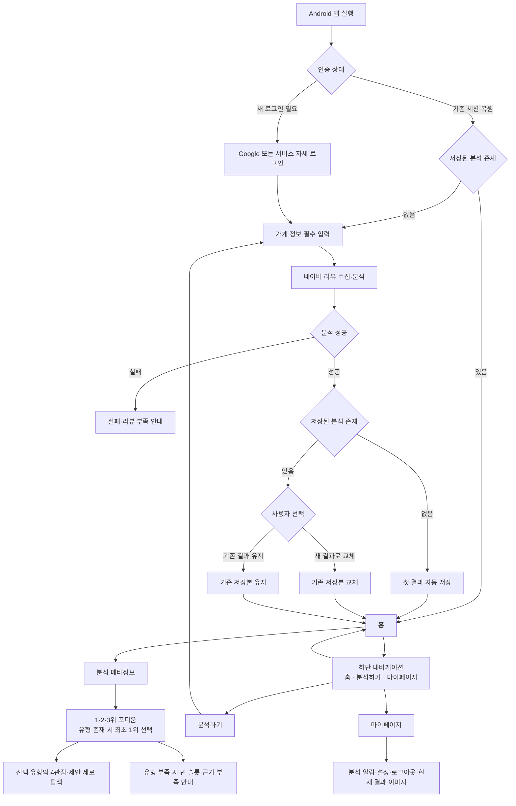

# PULSE MVP 사용자 플로우

## 1. 문서 개요

| 항목 | 내용 |
|---|---|
| 목적 | 확정된 서비스 진입·분석·결과 저장·내비게이션 구조를 사용자와 시스템의 흐름으로 정리한다 |
| 상태 | 핵심 사용자 흐름 확정 / 세부 화면 설계 전 |
| 기준일 | 2026-09-15 |
| 제품 요구사항 정본 | [PRD.md](../PRD.md) |
| 상세 기능명세 | [GUEST_ANALYSIS_FUNCTIONAL_SPEC.md](GUEST_ANALYSIS_FUNCTIONAL_SPEC.md) |
| 정보구조 | [RESULT_IA.md](RESULT_IA.md) |
| 저장 정책 | [ADR-005](../../decisions/ADR-005-analysis-storage-policy.md) |
| 소유 역할 | `role:product` |

흐름 개수는 목표가 아니다. 사용자 목적과 시스템 상태가 실질적으로 달라지는 구간만 분리했다. 확정된 결정만 기본 흐름에 사용하고, 결정되지 않은 화면 구성과 정책은 `미정`으로 표시한다.

## 2. 적용한 결정

1. 새 로그인에 성공한 사용자는 홈보다 먼저 가게 정보를 필수로 입력한다.
2. 분석이 완료되고 저장된 결과가 없으면 첫 결과를 자동 저장한다.
3. 홈은 현재 계정에 저장된 분석 결과 1개를 표시한다.
4. 사용자는 `분석하기`에서 새 분석을 실행할 수 있다.
5. 저장본이 있는 상태에서 새 분석이 끝나면 새 결과로 교체하거나 기존 결과를 유지한다.
6. 하단 내비게이션은 `홈 → 분석하기 → 마이페이지` 순서이며, 가운데 `분석하기`가 주요 행동이다.
7. 마이페이지에는 분석 완료·실패 인앱 알림, 알림 설정·서비스 정보, 로그아웃, 현재 저장 결과의 페르소나 이미지 최대 3개를 둔다.
8. 결과 상단의 1·2·3위 포디움이 손님 유형 탭으로 동작한다.
9. 결과는 분석 메타정보 다음 포디움을 보여주고, 도출된 페르소나가 1개 이상이면 최초 1위를 선택한다.
10. 선택한 손님 유형의 4관점 요약과 제안은 포디움 아래에서 세로로 이어진다.
11. 유효 토픽이 3개보다 적으면 포디움의 부족한 슬롯을 비우고 리뷰 근거 부족 메시지를 표시한다. 0개면 세 슬롯을 모두 비우고 선택 콘텐츠를 표시하지 않는다.

## 3. 전체 사용자 흐름

새 로그인 또는 기존 세션 복원 후 저장된 분석이 없으면 반드시 가게 정보 입력으로 이동한다. 첫 분석을 완료해 결과가 자동 저장되기 전에는 홈과 하단 내비게이션으로 넘어갈 수 없다.

## 4. 핵심 사용자 플로우

### UF-01 인증과 서비스 진입

| 항목 | 내용 |
|---|---|
| 시작 | 사용자가 Android 앱을 실행한다 |
| 새 로그인 | Google 또는 서비스 자체 로그인 → 인증 성공 → 가게 정보 입력으로 이동 |
| 기존 세션 복원 | 저장된 분석 결과가 있으면 홈으로 이동 |
| 기존 세션·저장본 없음 | 가게 정보 입력으로 이동. 첫 분석 완료 전에는 홈과 하단 내비게이션 진입 불가 |
| 예외 | 로그인 실패나 만료·폐기된 세션을 안내하고 로그인 화면에 머문다 |

### UF-02 필수 가게 정보 입력

| 항목 | 내용 |
|---|---|
| 시작 | 새 로그인 성공 또는 `분석하기` 선택 |
| 필수 입력 | 가게 이름 → 업종 1개 → 네이버 가게 URL |
| 정상 흐름 | 필수값·업종·URL 검증 → 가게 확인 → 분석 요청 |
| 오류 흐름 | 누락 필드, 허용 업종 밖의 값, 지원하지 않는 URL, 식별 불가능한 가게를 구분해 안내 → 입력 수정 |
| 미정 | 입력 화면 구성, 허용 URL 목록, 주소 확인, `기타` 세부 업종, 입력 정보 불일치 처리 |

### UF-03 리뷰 수집과 분석

| 항목 | 내용 |
|---|---|
| 기본 흐름 | 네이버 공개 리뷰 수집 → 작성자 식별정보 제외 → 중복·무효 리뷰 제거 → 유효 리뷰 수 판정 → 분석 → 정상 결과는 페르소나·이미지 3개, 유형 부족 결과는 도출된 수만큼 생성 → 제안 생성 → 결과 검증 |
| 진행 표시 | 수집·분석 중 현재 처리 단계를 표시한다 |
| 리뷰 부족 | 유효 리뷰 50건 미만이면 결과를 만들지 않고 현재 건수와 분석 불가를 안내한다 |
| 오래된 리뷰 | 2년보다 오래된 리뷰가 포함되면 결과에 정확성 우려 메시지를 표시한다 |
| 유형 부족 | 유효 토픽이 3개보다 적으면 도출된 유형만 포디움에 표시하고 나머지 슬롯은 비운 채 분석에 활용할 리뷰 근거가 부족하다는 메시지를 표시한다 |
| 실패 | 수집·분석·결과 검증·이미지 생성 실패는 완료 상태로 표시하지 않고, 발생 단계에서 원인·현재 상태·다음 행동을 안내한다 |
| 미정 | 대기 화면의 세부 구성, 작성일 미확인 리뷰 처리 |

`30~49건 경고 후 제공`과 `유형별 10건` 기준은 제안(미확정)이므로 이 흐름에 적용하지 않는다.

### UF-04 첫 결과 자동 저장과 홈

| 항목 | 내용 |
|---|---|
| 조건 | 분석이 완료됐고 계정에 저장된 분석 결과가 없다 |
| 시스템 처리 | 첫 분석 결과를 계정의 저장본으로 자동 저장한다 |
| 화면 이동 | 저장 완료 후 홈으로 이동한다 |
| 홈 역할 | 저장된 분석 결과 1개를 표시한다 |
| 저장 한도 | 계정의 저장 분석 결과는 항상 최대 1개다 |

### UF-05 홈에서 결과 탐색

| 항목 | 내용 |
|---|---|
| 시작 | 사용자가 홈에 진입한다 |
| 기본 흐름 | 분석 메타정보 확인 → 토픽별 리뷰 수가 많은 순서의 1·2·3위 포디움 확인 → 도출된 유형이 있으면 최초 1위 선택 → 선택 페르소나의 4관점·근거·제안을 세로로 탐색 |
| 화면 동작 | 포디움은 유지되고 선택한 유형의 아래 콘텐츠만 교체된다 |
| 유형별 콘텐츠 | 페르소나·이미지 → 긍정·부정·인식·우선순위 → 대표 근거 리뷰 1~2개 → 리뷰 사실과 검토할 행동 |
| 근거 상세 | 대표 근거 외 리뷰는 `근거 리뷰 전체 보기`로 확인한다 |
| 사실·해석 | `리뷰에서 확인`과 `AI 해석`을 별도 카드·배지·제목으로 구분한다 |
| 제안 상세 | AI 해석과 전문 지식은 펼쳐보기로 제공한다 |
| 유형 부족 | 3칸 포디움을 유지하고 도출된 유형만 채우며 빈 슬롯에 근거 부족 이유를 표시한다. 유형이 0개면 선택 콘텐츠를 표시하지 않는다 |
| 폐기 구조 | 리뷰 분석 / 손님 유형 / 제안을 독립 탭으로 나누지 않는다 |

### UF-06 새 분석과 저장 결과 선택

| 항목 | 내용 |
|---|---|
| 시작 | 사용자가 하단 내비게이션의 `분석하기`를 선택한다 |
| 분석 흐름 | 새 가게 정보 입력 → 검증 → 네이버 리뷰 수집·분석 → 새 결과 확인 |
| 분석 중 | 기존 저장본은 유지한다 |
| 선택 1 | `새 결과로 교체` → 기존 저장본을 새 결과로 교체 → 홈에 새 결과 표시 |
| 선택 2 | `기존 결과 유지` → 기존 저장본을 변경하지 않음 → 홈에 기존 결과 표시 |
| 저장 불변식 | 어떤 선택에서도 계정의 저장 결과는 1개다 |
| 미정 | 기존 결과 유지 후 미저장 새 결과의 접근·보관, 동시 분석 수, 선택 화면 문구와 배치 |

### UF-07 하단 내비게이션과 마이페이지

| 진입 항목 | 역할 |
|---|---|
| 홈 | 저장된 분석 결과 1개를 표시하고 손님 유형별 결과를 탐색한다 |
| 분석하기 | 새 가게 정보를 입력하고 분석을 실행한다 |
| 마이페이지 | 분석 완료·실패 인앱 알림, 알림 설정·서비스 정보, 로그아웃, 현재 저장 결과의 페르소나 이미지로 이동한다 |

하단 내비게이션은 왼쪽부터 `홈 → 분석하기 → 마이페이지` 순서이며 가운데 `분석하기`를 주요 행동으로 강조한다. 마이페이지는 다음 최소 범위로 제한한다.

- 알림은 분석 작업 완료·실패만 인앱으로 보여준다. 홍보 알림과 OS 푸시는 제공하지 않는다.
- 설정은 분석 알림 켜기·끄기와 서비스 정보만 제공한다.
- 페르소나 이미지 보관은 현재 저장된 분석 결과의 이미지 최대 3개를 읽기 전용으로 보여준다. 저장 결과를 교체하면 이미지도 함께 교체하며 별도 아카이브나 개별 삭제는 제공하지 않는다.
- 로그아웃은 현재 서비스 세션을 종료하고 로그인 화면으로 이동한다.

## 5. 결과 화면 IA에 남은 결정

1. 유형별 최소 리뷰 수 기준을 별도로 도입할지
2. 가게 지정 화면과 분석 대기 화면의 세부 시각 구성
3. 기존 결과 유지 후 미저장 새 결과의 접근·보관 정책
4. 포디움의 스크롤 중 sticky 동작을 사용할지

## 6. 적용하지 않은 제안

| 제안 구간 | 제안 동작 | 현재 상태 |
|---|---|---|
| 50건 이상 | 정상 제공 | 제안 중 이 구간은 현 PRD의 50건 기준과 결과가 같음 |
| 30~49건 | 경고 후 제공 | 미확정. 현 PRD는 분석하지 않음 |
| 30건 미만 | 분석 결과 미제공 | 미확정 제안이며 현 PRD는 50건 미만 전체를 분석하지 않음 |
| 유형별 10건 미만 | 해당 순위 경고 | 미확정 |

제안 근거와 한계는 [MVP 정보구조](RESULT_IA.md)에서 [FINAL_RESEARCH_REPORT.md](../../../research/FINAL_RESEARCH_REPORT.md)의 E-R09와 G6 원문을 대조해 기록했다. 이 문서에서는 해당 제안을 현재 확정 흐름으로 사용하지 않았다.

## 7. 검증 기록

| 검증 | 결과 |
|---|---|
| PRD §6·§7·§10·§13 대조 | 확인 |
| ADR-005 저장 정책 대조 | 확인 |
| 사용자 플로우 수 | 7개 — 목적과 상태 전환 기준으로 구분 |
| 확정사항과 미정사항 분리 | 확인 |
| 상대 링크 | 전체 문서 기준 깨진 링크 0개 |
| UI 렌더링 | 미실행 — 사용자 플로우 문서 작업 |
| 애플리케이션 테스트 | 미실행 — 코드 변경 없음 |
