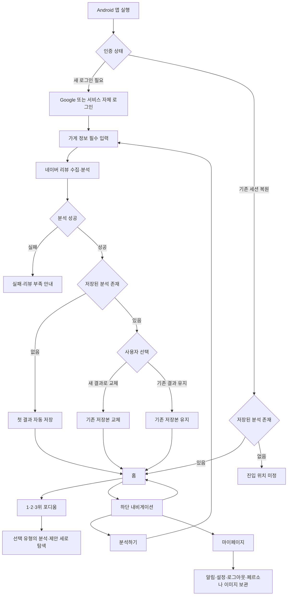

# PULSE MVP 사용자 플로우

## 1. 문서 개요

| 항목 | 내용 |
|---|---|
| 목적 | 확정된 서비스 진입·분석·결과 저장·내비게이션 구조를 사용자와 시스템의 흐름으로 정리한다 |
| 상태 | 진행 중 초안 |
| 기준일 | 2026-09-13 |
| 제품 요구사항 정본 | [PRD.md](../PRD.md) |
| 상세 기능명세 | [GUEST_ANALYSIS_FUNCTIONAL_SPEC.md](GUEST_ANALYSIS_FUNCTIONAL_SPEC.md) |
| 정보구조 | [RESULT_IA.md](RESULT_IA.md) |
| 저장 정책 | [ADR-005](../../decisions/ADR-005-analysis-storage-policy.md) |
| 소유 역할 | `role:product` |

흐름 개수는 목표가 아니다. 사용자 목적과 시스템 상태가 실질적으로 달라지는 구간만 분리했다. 확정된 결정만 기본 흐름에 사용하고, 결정되지 않은 화면 구성과 정책은 `미정`으로 표시한다.

## 2. 적용한 결정

1. 새 로그인에 성공한 사용자는 홈보다 먼저 가게 정보를 필수로 입력한다.
2. 분석이 완료되고 저장된 결과가 없으면 첫 결과를 자동 저장한다.
3. 홈은 현재 계정에 저장된 분석 결과 1개를 표시한다.
4. 사용자는 `분석하기`에서 새 분석을 실행할 수 있다.
5. 저장본이 있는 상태에서 새 분석이 끝나면 새 결과로 교체하거나 기존 결과를 유지한다.
6. 하단 내비게이션 항목은 `홈`·`분석하기`·`마이페이지`다. 시각적 순서는 미정이다.
7. 마이페이지에는 알림·설정·로그아웃·페르소나 이미지 보관 공간을 둔다. 세부 기능은 미정이다.
8. 결과 상단의 1·2·3위 포디움이 손님 유형 탭으로 동작한다.
9. 선택한 손님 유형의 분석과 제안은 포디움 아래에서 세로로 이어진다.

## 3. 전체 사용자 흐름

기존 세션을 복원했고 저장된 분석이 있으면 홈으로 이동한다. 유효 세션은 있지만 저장된 분석이 없는 경우의 진입 위치는 아직 정하지 않았다. 새 로그인을 완료한 경우에는 가게 정보 입력을 거쳐야 한다.

## 4. 핵심 사용자 플로우

### UF-01 인증과 서비스 진입

| 항목 | 내용 |
|---|---|
| 시작 | 사용자가 Android 앱을 실행한다 |
| 새 로그인 | Google 또는 서비스 자체 로그인 → 인증 성공 → 가게 정보 입력으로 이동 |
| 기존 세션 복원 | 저장된 분석 결과가 있으면 홈으로 이동 |
| 기존 세션·저장본 없음 | 홈의 empty 상태를 보여줄지 가게 정보 입력으로 이동할지 미정 |
| 예외 | 로그인 실패나 만료·폐기된 세션을 안내하고 로그인 화면에 머문다 |

### UF-02 필수 가게 정보 입력

| 항목 | 내용 |
|---|---|
| 시작 | 새 로그인 성공 또는 `분석하기` 선택 |
| 필수 입력 | 가게 이름 → 업종 1개 → 네이버 가게 URL |
| 정상 흐름 | 필수값·업종·URL 검증 → 가게 확인 → 분석 요청 |
| 오류 흐름 | 누락 필드, 허용 업종 밖의 값, 지원하지 않는 URL, 식별 불가능한 가게를 구분해 안내 → 입력 수정 |
| 미정 | 입력 화면 구성, 허용 URL 목록, 주소 확인, `기타` 세부 업종, 입력 정보 불일치 처리 |

### UF-03 리뷰 수집과 분석

| 항목 | 내용 |
|---|---|
| 기본 흐름 | 네이버 공개 리뷰 수집 → 작성자 식별정보 제외 → 중복·무효 리뷰 제거 → 유효 리뷰 수 판정 → 분석 → 페르소나 3개와 이미지 3개 생성 → 제안 생성 → 결과 검증 |
| 진행 표시 | 수집·분석 중 현재 처리 단계를 표시한다 |
| 리뷰 부족 | 유효 리뷰 50건 미만이면 결과를 만들지 않고 현재 건수와 분석 불가를 안내한다 |
| 오래된 리뷰 | 2년보다 오래된 리뷰가 포함되면 결과에 정확성 우려 메시지를 표시한다 |
| 실패 | 수집·분석·결과 검증·이미지 생성 실패는 완료 상태로 표시하지 않는다 |
| 미정 | 대기 화면 구성, 작성일 미확인 리뷰 처리, 예외 상태 배치 |

`30~49건 경고 후 제공`과 `유형별 10건` 기준은 제안(미확정)이므로 이 흐름에 적용하지 않는다.

### UF-04 첫 결과 자동 저장과 홈

| 항목 | 내용 |
|---|---|
| 조건 | 분석이 완료됐고 계정에 저장된 분석 결과가 없다 |
| 시스템 처리 | 첫 분석 결과를 계정의 저장본으로 자동 저장한다 |
| 화면 이동 | 저장 완료 후 홈으로 이동한다 |
| 홈 역할 | 저장된 분석 결과 1개를 표시한다 |
| 저장 한도 | 계정의 저장 분석 결과는 항상 최대 1개다 |

### UF-05 홈에서 결과 탐색

| 항목 | 내용 |
|---|---|
| 시작 | 사용자가 홈에 진입한다 |
| 기본 흐름 | 저장된 분석 결과 확인 → 토픽별 리뷰 수가 많은 순서의 1·2·3위 포디움 확인 → 순위 선택 → 선택 유형의 콘텐츠를 세로로 탐색 |
| 화면 동작 | 포디움은 유지되고 선택한 유형의 아래 콘텐츠만 교체된다 |
| 유형별 콘텐츠 | 페르소나·이미지·분석·마케팅 및 운영 제안 |
| 폐기 구조 | 리뷰 분석 / 손님 유형 / 제안을 독립 탭으로 나누지 않는다 |
| 미정 | 가게 전체 4관점 분석 위치, 근거 리뷰 노출, 사실과 AI 해석 표현, 제안 내부 위계, 라벨 체계 |

### UF-06 새 분석과 저장 결과 선택

| 항목 | 내용 |
|---|---|
| 시작 | 사용자가 하단 내비게이션의 `분석하기`를 선택한다 |
| 분석 흐름 | 새 가게 정보 입력 → 검증 → 네이버 리뷰 수집·분석 → 새 결과 확인 |
| 분석 중 | 기존 저장본은 유지한다 |
| 선택 1 | `새 결과로 교체` → 기존 저장본을 새 결과로 교체 → 홈에 새 결과 표시 |
| 선택 2 | `기존 결과 유지` → 기존 저장본을 변경하지 않음 → 홈에 기존 결과 표시 |
| 저장 불변식 | 어떤 선택에서도 계정의 저장 결과는 1개다 |
| 미정 | 기존 결과 유지 후 미저장 새 결과의 접근·보관, 동시 분석 수, 선택 화면 문구와 배치 |

### UF-07 하단 내비게이션과 마이페이지

| 진입 항목 | 역할 |
|---|---|
| 홈 | 저장된 분석 결과 1개를 표시하고 손님 유형별 결과를 탐색한다 |
| 분석하기 | 새 가게 정보를 입력하고 분석을 실행한다 |
| 마이페이지 | 알림·설정·로그아웃·페르소나 이미지 보관 공간으로 이동한다 |

하단 내비게이션 세 항목의 시각적 순서는 미정이다. 마이페이지에는 사용자가 승인한 네 항목만 기록했으며 다음 세부사항은 아직 정하지 않았다.

- 알림에서 보여줄 대상과 알림 전달 방식
- 설정에 포함할 항목
- 페르소나 이미지 보관 개수, 저장·삭제 방식

## 5. 결과 화면 IA에 남은 결정

1. 가게 전체 차원의 긍정 신호·부정 신호·인식·우선순위를 어디에 둘지
2. 유효 토픽이 3개보다 적은 분석 불충분 상태와 3칸 포디움의 관계
3. 3위 유형이 별도 최소 리뷰 기준을 충족하지 못할 때 포디움 3번 칸을 어떻게 표현할지
4. 근거 리뷰를 기본 노출할지 상세 진입으로 둘지
5. 리뷰 사실과 AI 해석을 어떤 정보 계층으로 구분할지
6. 제안 4레이어 중 무엇을 기본으로 노출할지
7. 오류·한계 상태를 어느 화면 계층에 배치할지
8. 결과 화면 라벨 체계
9. 유효 세션은 있지만 저장본이 없는 경우의 진입 위치

## 6. 적용하지 않은 제안

| 제안 구간 | 제안 동작 | 현재 상태 |
|---|---|---|
| 50건 이상 | 정상 제공 | 제안 중 이 구간은 현 PRD의 50건 기준과 결과가 같음 |
| 30~49건 | 경고 후 제공 | 미확정. 현 PRD는 분석하지 않음 |
| 30건 미만 | 포디움 구조 성립 불가 | 미확정 |
| 유형별 10건 미만 | 해당 순위 경고 | 미확정 |

제안 근거와 한계는 [MVP 정보구조](RESULT_IA.md)에서 [FINAL_RESEARCH_REPORT.md](../../../research/FINAL_RESEARCH_REPORT.md)의 E-R09와 G6 원문을 대조해 기록했다. 이 문서에서는 해당 제안을 현재 확정 흐름으로 사용하지 않았다.

## 7. 검증 기록

| 검증 | 결과 |
|---|---|
| PRD §6·§7·§10·§13 대조 | 확인 |
| ADR-005 저장 정책 대조 | 확인 |
| 사용자 플로우 수 | 7개 — 목적과 상태 전환 기준으로 구분 |
| 확정사항과 미정사항 분리 | 확인 |
| 상대 링크 | 전체 문서 기준 깨진 링크 0개 |
| UI 렌더링 | 미실행 — 사용자 플로우 문서 작업 |
| 애플리케이션 테스트 | 미실행 — 코드 변경 없음 |
